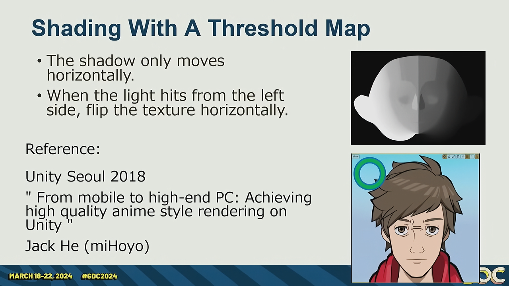

>Refer:[3D Toon Rendering in 'Hi-Fi RUSH'](https://youtu.be/gdBACyIOCtc?si=GvZljy0oLHoUwoGK)

# Goals

使用ue4进行卡通渲染，包括角色和场景。

优先确保60fps

画面干净锐利鲜亮

# overview

Deferred lighting + toon post-processing.

Target: decouple toon rendering and gbuffer rendering. Artists can change toon postprocess volume to change areas which want to use toon shading.

use individual toon postprocessing params for each lighting layer

# Shadow color

Target:Need different shadow color.

  

Use shadow volume ,implemented by mapping 3d texture to 3d world position.

Ambient cubemap volume to customlize ambient

# Comic shader

- Lit: halftone dot
    

- Shadow : hatching lines

## Shader on / off

  
  

Dirty GI and SSAO, remove gradation  

---

  

Use smoothstep and alpha blend to anti aliasing

Tips : not suit bloom things

Avoid these halftones look like print on the camera instead of on the models(we dont want this )

Adapt to luminace strength, larger the luminace bigger

# Toon lights

In base pass , change lighting in forward render.

Mostly use decal lights instead of forward lights

Step gradiation lights

Decal lights can use a decal volume to specifically assign which area needs to be lighted . Also, it will have a smaller area to lighting and better art control instead of forward lights because of the decal volume. Decal volume can be used to prevent light leaking .

Character render is not influenced by environment lighting(decal lights and forward lights).

# Shadows

## Shadow-only lights

use shadow-only lights to player, character and environment.

player and giant-boss's shadow is seperated from environment cascaded shadows.

## Enemy shadows

enemy shadow use capsule shadows for high performance.

For little floating in the air enemy, use cpu raycast to decal shadows

## Static shadow map

艺术家手动放置摄像机生成一张深度图，使用volume以渲染这些深度图对应的阴影。

预烘焙相机的深度图。

4x4的pcf消除锯齿。

# GI

ue4 light mass 烘焙时间太长

自定义一套light volumetric light map 以提高烘焙速度和可用性。

原因之一：可选择需要GI烘焙的部分区域

修改了ue4 将 光照探针按照per actor 存储 而不是per level

## GI workflow

1. 用一个world volume lighting volumer actor 选择需要烘焙GI的区域
    
2. 开始烘焙，等待1，2mins，区域内的GI烘焙完成
    

# Toon face shadow

Face shadow should **always clean .**

Problems:

1. Model normal will lead to a messy shadow
    

2. Face motion will break shadow shape
    

3. Artist cant solve 1 and 2 problems by adjusting model
    

**Solution** : mihoyo 's sdf face shadow (i can do it ,so i dont explain it )

  

