> 本博客为SAST.Graphics组授课文档记录

---
  
``
# 前言

本课程大量参考GAMES101、RTR4-CN、B站视频等资料，如有雷同，应该不是巧合。

## 我们的授课不包含这些
- 3D建模软件/游戏引擎入门到精深

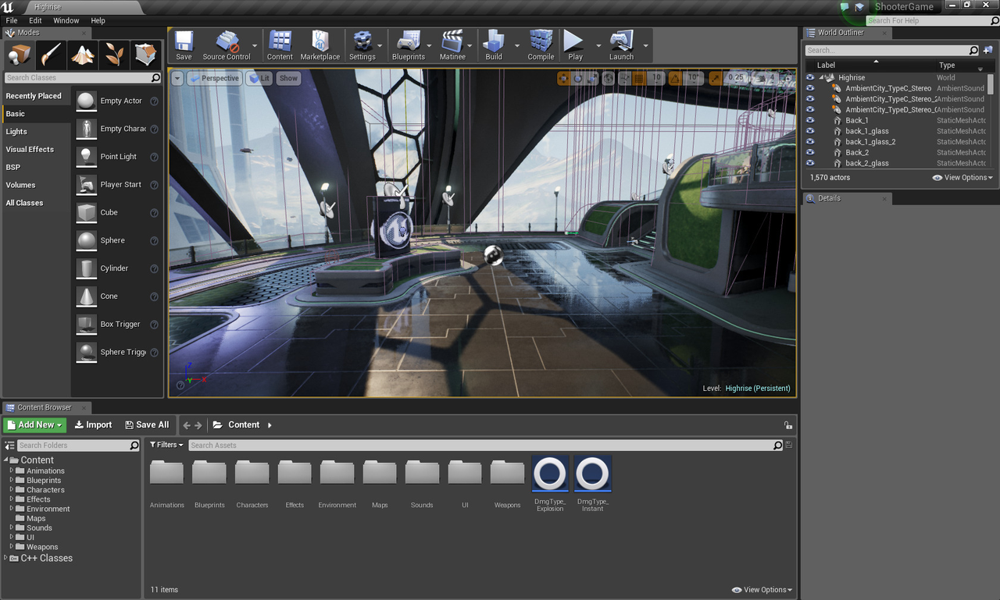

- 计算机视觉（Computer Vision）

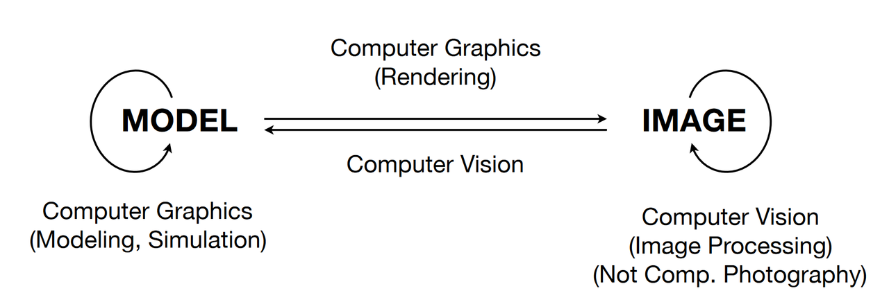

- 深度学习（deep learning）   
ml等人工智能领域使用显卡是因为显卡并行处理大型数据和计算矩阵的优势，和图形学没有任何关系！

## 我们的课程不需要一张独立显卡/一台游戏本！

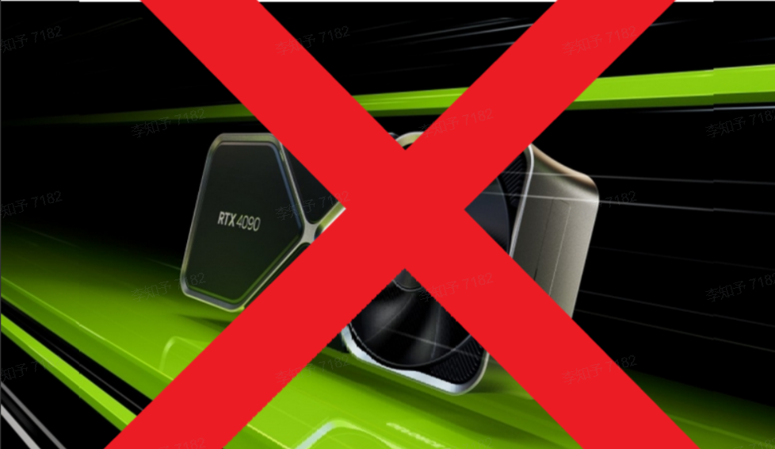

我们的教学聚焦于图形学原理，不需要高性能的显卡做算力支持。只需要你的电脑能够正常启动，那么基本可以肯定你的电脑足以进行编程和学习。

## 使用一个IDE（集成开发环境）！

我不想有人使用

- txt文本阅读器/记事本
- vi/vim/emacs

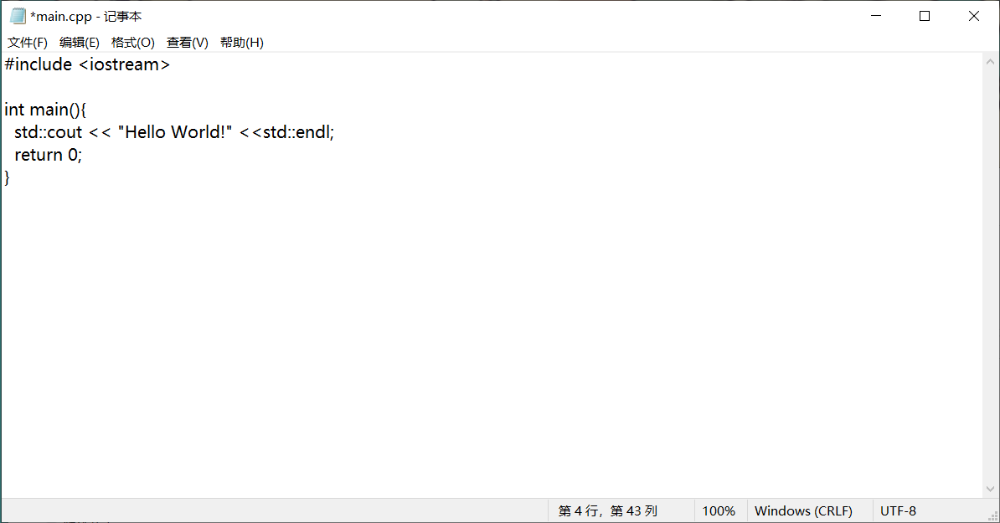
 
大哥你至少用个写代码的玩意。。

- Dev C++

不能支持多文件编译的低能软件，界面还丑

界面过丑不予展示

### 个人推荐IDE

- MSVC：大，全，重；可用，我只推荐windows平台用来做编译器
- Visual Studio Code + CMake + MSVC
- Jetbrains Clion一把梭
关于C++，可以去校科协C++组学习。

## 学习图形学能对我有什么帮助？

### 校招

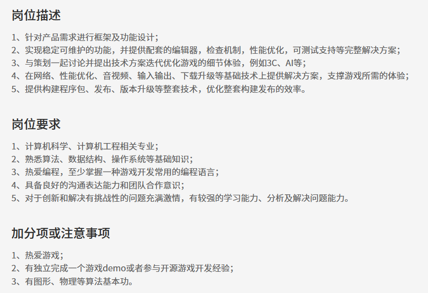

大部分游戏客户端都会把图形学作为加分项，近年更是在越来越卷的环境下又成为人手必备的技能的趋势。
### 考研
计算机图形学是计算机科学大类下的一个子学科。
# 计算机图形学简介

**计算机图形学**是计算机科学的一个子领域，研究数字合成和操作视觉内容的方法。尽管该术语通常指三维计算机图形学的研究，但它也包含二维图形和图像处理。

## 图形学细分领域

### 渲染（Render）

**渲染**或**图像合成**是通过计算机程序从2D或3D 模型生成真实感或非真实感图像的过程。可以在包含严格定义的语言或数据结构的对象的_场景文件_中定义多个模型。场景文件包含描述虚拟场景的几何、视点、纹理、照明和着色信息。然后场景文件中包含的数据被传递到渲染程序进行处理并输出到数字图像或光栅图形图像文件。术语“渲染”类似于艺术家对场景的印象的概念。术语“渲染”也用于描述在视频编辑程序中计算效果以产生最终视频输出的过程。

渲染是3D 计算机图形学的**主要子主题**之一，在实践中它总是与其他主题相关。这是图形管道中的最后一个主要步骤，为模型和动画提供最终外观。自 20 世纪 70 年代以来，随着计算机图形学的日益复杂，它已成为一门更加独特的学科。

渲染可用于建筑、视频游戏、模拟器、电影和电视视觉效果以及设计可视化，每种都采用不同的功能和技术平衡。有多种渲染器可供使用。有些集成到更大的建模和动画包中，有些是独立的，有些是免费的开源项目。从内部来看，渲染器是一个基于多个学科精心设计的程序，包括物理光学、视觉感知、数学和软件开发。

### 几何（Geometry）

几何学的子领域研究在离散数字环境中三维物体的表示。由于对象的外观在很大程度上取决于其外部，因此边界表示法是最常用的。二维表面是大多数物体的良好表示，尽管它们可能是非流形的。由于曲面不是有限的，因此使用离散数字近似。多边形网格（以及较小程度上的细分曲面）是迄今为止最常见的表示，尽管基于点的表示最近变得更加流行（例如，参见基于点的图形研讨会）。最近，_欧拉_表面描述（即，其中空间样本是固定的），例如水平集，已经发展成用于使经历许多拓扑变化的表面变形的有用表示（流体是最显著的示例）。

### 动画仿真（Animation and Simulation）

动画的子领域研究随着时间的推移移动或变形的表面（和其他现象）的描述。从历史上看，这一领域的大多数工作都集中在参数和数据驱动的模型上，但最近随着计算机在计算方面变得更加强大，物理模拟变得更加流行。

动画子领域包括：
- 动作捕捉    
- 角色动画
- 物理模拟（例如布料建模、流体动力学动画等）

## 图形学应用领域

(以下图片来自)

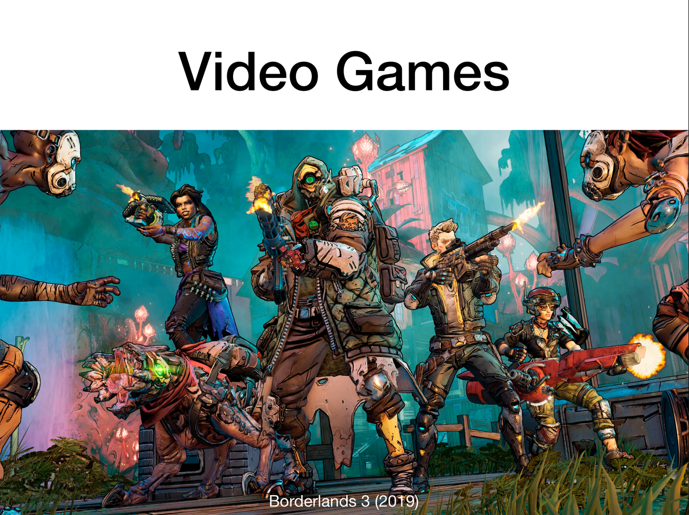

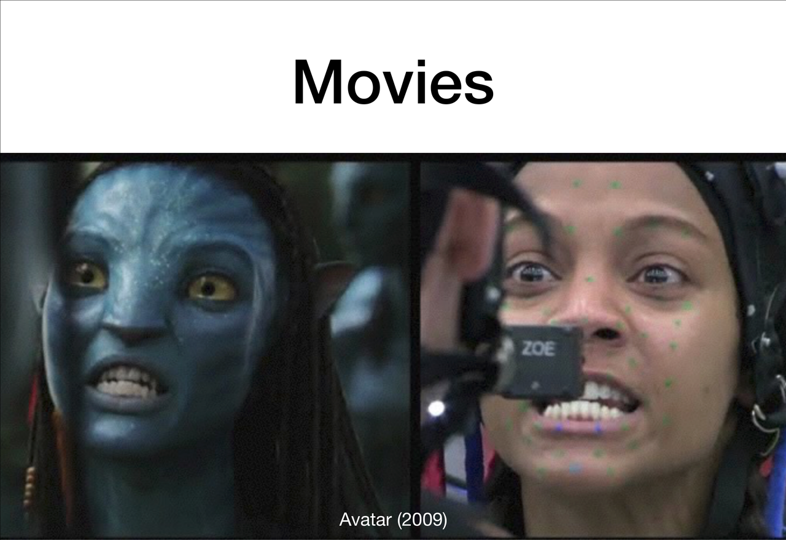

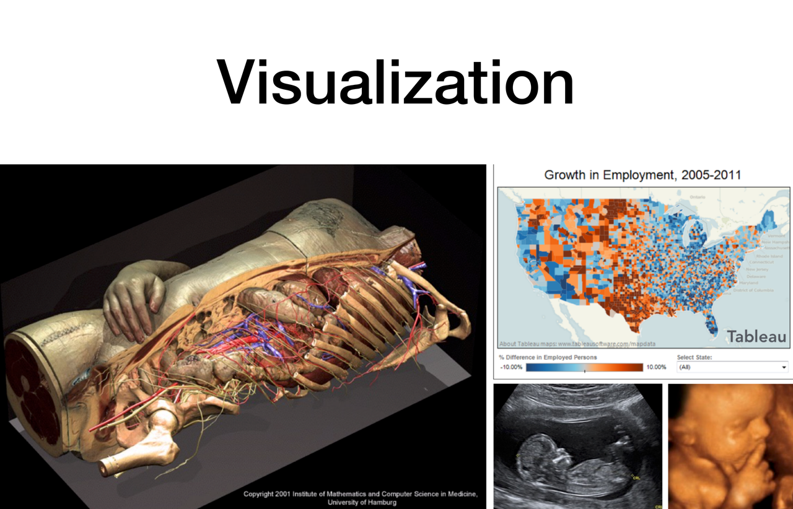

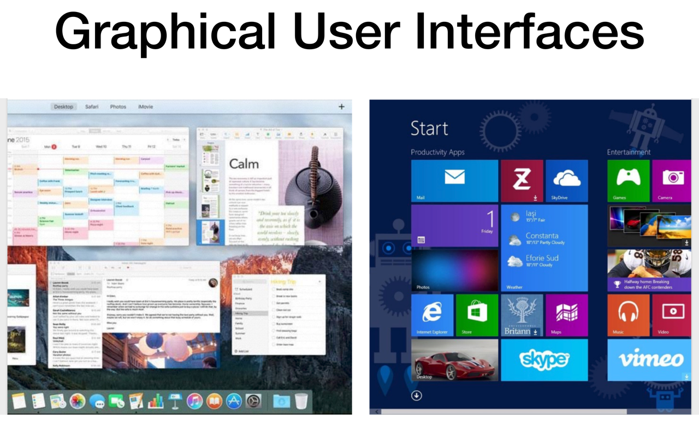

## 为什么学习图形学？

### 图形学学习中的困难

- 理解真实世界的物理规律并创造真实的虚拟世界
- 投影，曲线，表面的数学表示
- 光学和着色的物理学知识
- 表示/操作3D形体
- 动画/模拟

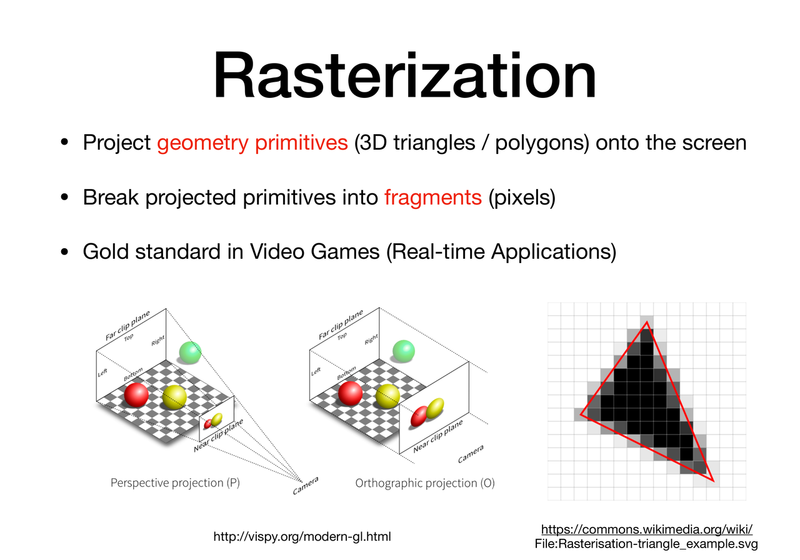
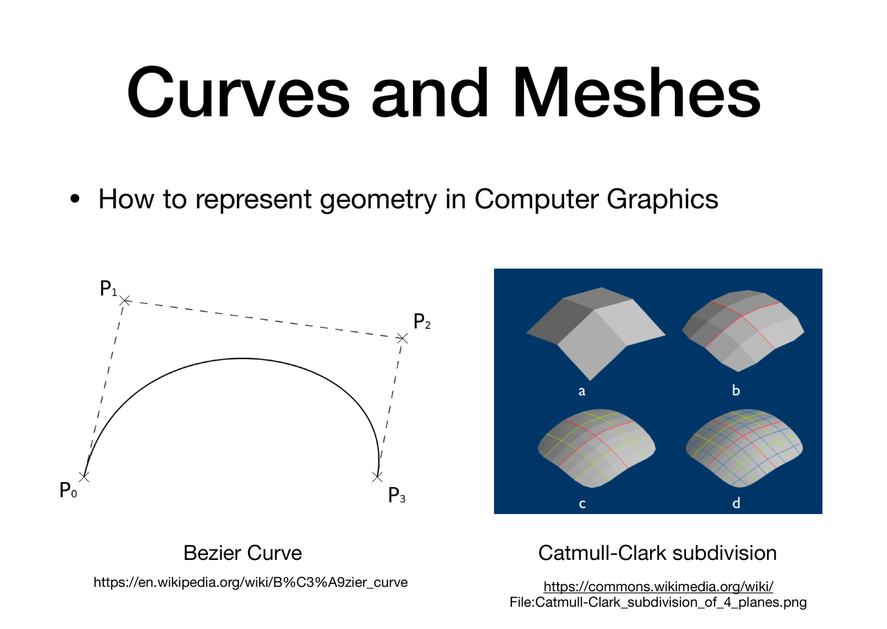
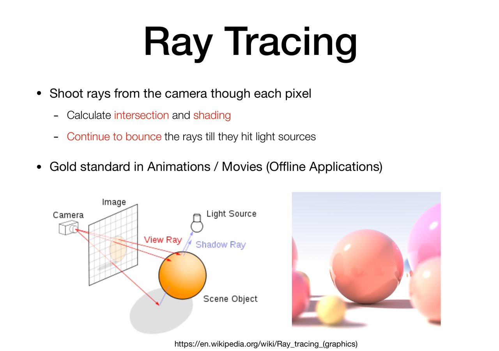

# Why is GPU?

	“The display is the computer.” ——Jen-Hsun Huang

## 计算机八大件

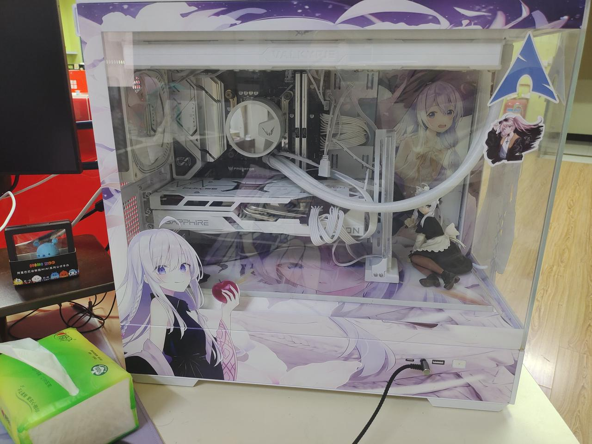

机箱、CPU、主板、内存、散热器、显卡、电源、硬盘

为什么显卡如此特殊，它和CPU一样，共同拥有作为处理器的崇高地位，却只负责一件事：图像处理？

#### 可怕的计算量

现代显示器最低分辨率为1920x1080，我们假设每秒渲染60张图像，那么结果是

**1920 * 1080 * 60 = 124,416,000 次！**

---

如果说你的电脑配置比较好，显示器有4k分辨率（3840x2160），每秒渲染144张图像，那么结果是多少？

**3840 * 2160 * 144 = 1,194,393,600 次！**

不仅如此，我们只考虑了每个像素产生颜色的过程，如果是玩游戏，通常来说会有百万级别的三角面需要同时处理。

让宝贵的CPU花费大量性能去做这种体力活毫无疑问是非常低性价比和愚蠢的。所以工程师们很快想出了一个方法：我专门做个硬件去产生图像数据不就行了？

## GPU简史

### 初期（1980s）

在计算机发展初期，计算机图形的显示是由CPU完成的，但是随着计算机图形需求的增长，尤其是游戏，2D图形领域的需求，最开始的图形加速硬件（图形加速器）被设计并制造出来，主要用于三角形的像素扫描线插值，并将其显示在显示器上。这时候的GPU只是一个搬运工，它只负责显示2D图像。此时它被称为图形加速器。

### 发展（1990s）

1990年代，3D图形技术随着电子游戏和CAD的发展而发展，市面上出现了大量的3D加速卡，最著名的显卡便是3dfx的Voodoo系列。Voodoo系列卡通过独立的3D处理单元处理几何运算、纹理映射和光栅化，专门加速游戏中的3D图形。这个时期的经典游戏如《古墓丽影》、《雷神之锤》等大幅受益于Voodoo卡的加速。

图形API逐渐标准化，1992年推出的OpenGL和1995年微软推出了DirectX，给游戏开发者和软件厂商提供了一个统一的平台来开发3D图形应用程序。API的标准化推动了GPU的发展，因为它让硬件厂商能够专注于提高图形处理器的性能，而开发者则可以通过这些标准API与硬件进行交互。

1999年，划时代的芯片NVIDIA Geforce256 发布了，GPU这个术语被创造出来用以区分GeForce 256 和过去所有图形加速卡的区别。首次引入了硬件变换和光栅化（Transform and Lightling），将图形处理转移到GPU，提高了3D处理的速度。但此时的渲染过程仍然是固定的，开发者无法自由地实现自己的想要的功能。

### 可编程着色器（2000s）
Vertex Shader 和 Fragment Shader正式出现，开发者可以通过程序自定义想要的效果。

### 后续（2000s-至今）
科研人员发现GPU能一口气处理这么多数据，相比CPU更适合做科研时产生的大量数据的处理，CUDA应运而生。一段时间后，人工智能蓬勃发展，GPU的并行处理能力被用来进行人工智能训练。AI的爆火又反过来促进显卡厂商加入Tensor（张量）单元进行ai训练。

## GPU架构

在GPU架构之前，我们先来看看CPU的基础架构。

CPU 经过优化,可以处理大量的数据结构和大型代码段,CPU 一般都具有多个处理器,每个处理器都以串行的方式来执行代码,但是有限的 SIMD 向量处理是一个小例外。为了最小化延迟所带来的影响,CPU 芯片中的大部分面积都是高速的本地缓存,这些缓存中存满了接下来可能会用到的数据。CPU 还会使用一些智能技术来避免停滞,例如分支预测(branch predication)、指令重排序(instruction reordering)、寄存器重命名(register renaming)和缓存预取(prefetching)等。

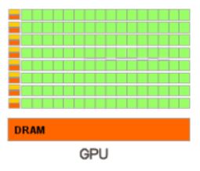

GPU则完全不同，GPU芯片中很大一片面积都是大量的处理器，这些相同的处理器通常有数千个，用来处理相似的数据。为了一次性处理大量的数据，GPU对吞吐量(throughput)做了专门的优化，吞吐量指的是数据能够被处理的最大速度。但是GPU用于控制和缓存的芯片较少，所以GPU的延迟普遍比CPU的延迟要大。

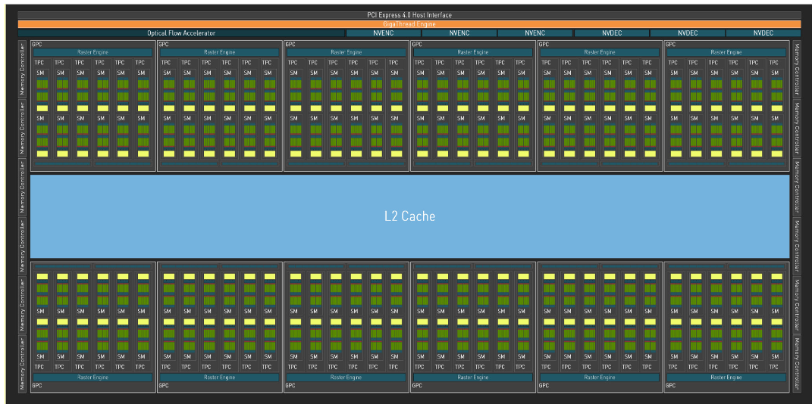

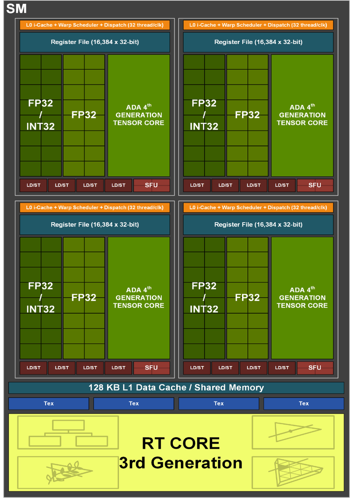

以AD102为例，GPU芯片有12个GPC，每个GPC内有12个SM单元，每个SM单元有128CUDA核心。

所以AD102核心中有**12 * 12 * 128=18432** 个CUDA单元，每个单元负载一个线程。32个CUDA核心组成了一个 **warp** 。warp作为基本单元接受相同指令和不同的数据进行处理。这种架构叫做SIMD（Single Instruction Multiple Data）

# Other

## 推荐图书？

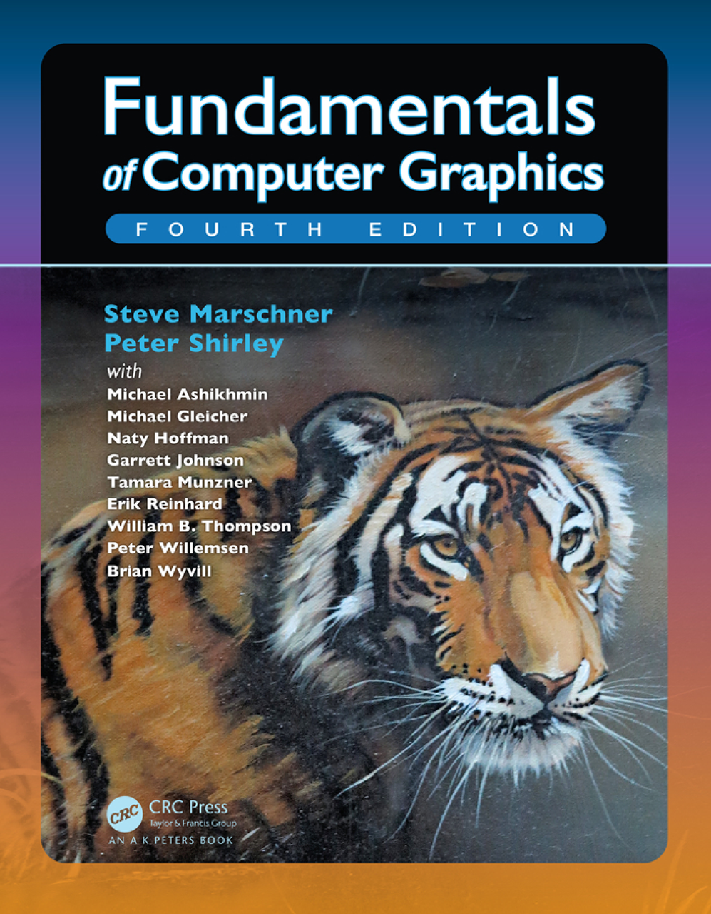

## 自学路径

GAMES002、GAMES101、tinyrender、GAMES202……
