	本文章为SAST.Graphics组授课文档记录

> 引用资料：
> 1. [毛星云：PBR白皮书](https://zhuanlan.zhihu.com/p/53086060)
> 2. [LearnOpenGL-CN](https://learnopengl-cn.github.io/07%20PBR/01%20Theory/)
> 3. [百人计划-5.1 PBR基础](https://www.bilibili.com/video/BV1fL411F7YG/)


# PBR核心理论
基于物理的渲染（Physically Based Rendering，PBR）是指使用基于物理原理和微平面理论建模的着色/光照模型，以及使用从现实中测量的表面参数来准确表示真实世界材质的渲染理念。它指的是在不同程度上使用与现实世界的物理原理更相符的基本理论所构成的渲染技术的集合。正因为基于物理的渲染目的便是使用一个中更符合物理学规律的方式来模拟光线，因此PBR的渲染效果总是比实际上看上去要更真实一些。除此之外，因为它与物理性质的相似，所以艺术家可以直接基于物理参数来编写材质，而不需要依据经验和反复试错使光照效果看起来正常。

寒霜(Frostbite)引擎在SIGGRAPH 2014的分享《Moving Frostbite to PBR》中提出，基于物理的渲染的范畴，由三部分组成：
- 基于物理的材质（Material）
- 基于物理的光照（Lighting）
- 基于物理适配的摄像机（Camera)

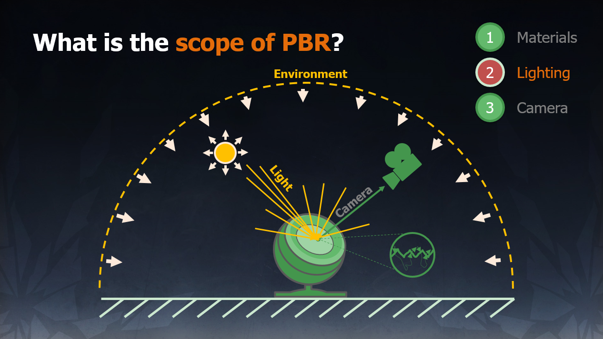

完整的这三者，才是真正完整的基于物理的渲染系统。

---

值得注意的是，PBR仍然只是对现实世界的一种**近似**，所以它被称为**基于**物理的渲染（Physically **Based** Rendering），而不是物理渲染（Physically Rendering）！
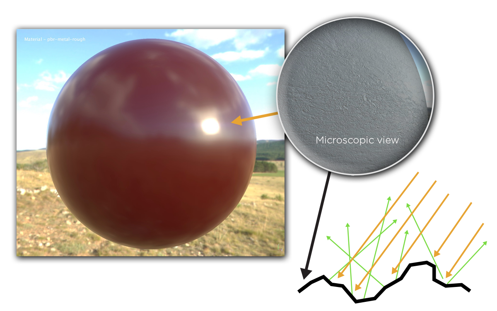
- **微平面理论（Microfacet Theory）** :微平面理论是将物体表面建模成做无数微观尺度上有随机朝向的理想镜面反射的小平面（microfacet）的理论。在实际的PBR工作流中，这种物体表面的不规则性用粗糙度贴图或者高光度贴图来表示。
- **能量守恒（Energy Conservation）** :出射光线的能量永远不能超过入射光线的能量。随着粗糙度的上升镜面反射区域的面积会增加，作为平衡，镜面反射区域的平均亮度则会下降。
- **菲涅尔反射（Fresnel Reflectance）** :光线以不同角度入射会有不同的反射率。相同的入射角度，不同的物质也会有不同的反射率。万物皆有菲涅尔反射。F0是即 0 度角入射的菲涅尔反射值。大多数非金属的F0范围是0.02~0.04，大多数金属的F0范围是0.7 ~ 1.0。
- **线性空间（Linear Space）** :光照计算必须在线性空间完成，shader中输入的gamma空间的贴图比如漫反射贴图需要被转成线性空间，在具体操作时需要根据不同引擎和渲染器的不同做不同的操作。而描述物体表面属性的贴图如粗糙度，高光贴图，金属贴图等必须保证是线性空间。
- **色调映射（Tone Mapping）** :也称色调复制（tone reproduction），是将宽范围的照明级别拟合到屏幕有限色域内的过程。因为基于HDR渲染出来的亮度值会超过显示器能够显示最大亮度，所以需要使用色调映射，将光照结果从HDR转换为显示器能够正常显示的LDR。
- **物质的光学特性（Substance Optical Properties）**: 现实世界中有不同类型的物质可分为三大类：绝缘体（Insulators），半导体（semi-conductors）和导体（conductors）。在渲染和游戏领域，我们一般只对其中的两个感兴趣：导体（金属）和绝缘体（电解质，非金属）。其中非金属具有单色/灰色镜面反射颜色。而金属具有彩色的镜面反射颜色。即非金属的F0是一个float。而金属的F0是一个float3。
# 微表面理论
## 光与非光学平坦表面的交互原理

大多数真实世界的表面不是光学上光滑的，但是具有比光波长大得多但比像素小的尺度的不规则性。 这种**微观几何**（microgeometry）变化导致每个表面点反射（和折射）不同方向的光：材质的部分外观组成是这些反射和折射方向的聚合结果。
光在与非光学平坦表面（Non-Optically-Flat Surfaces)的交互时，非光学平坦表面表现的像一个微小的光学平坦表面的大集合。表面上的每个点都会以略微不同的入射光反射，而最终反射的表面外观是许多不同取向的点的聚合结果。
在微观尺度上，表面越模糊，反射越模糊，因为微表面与整个宏观表面取向的偏离更强。

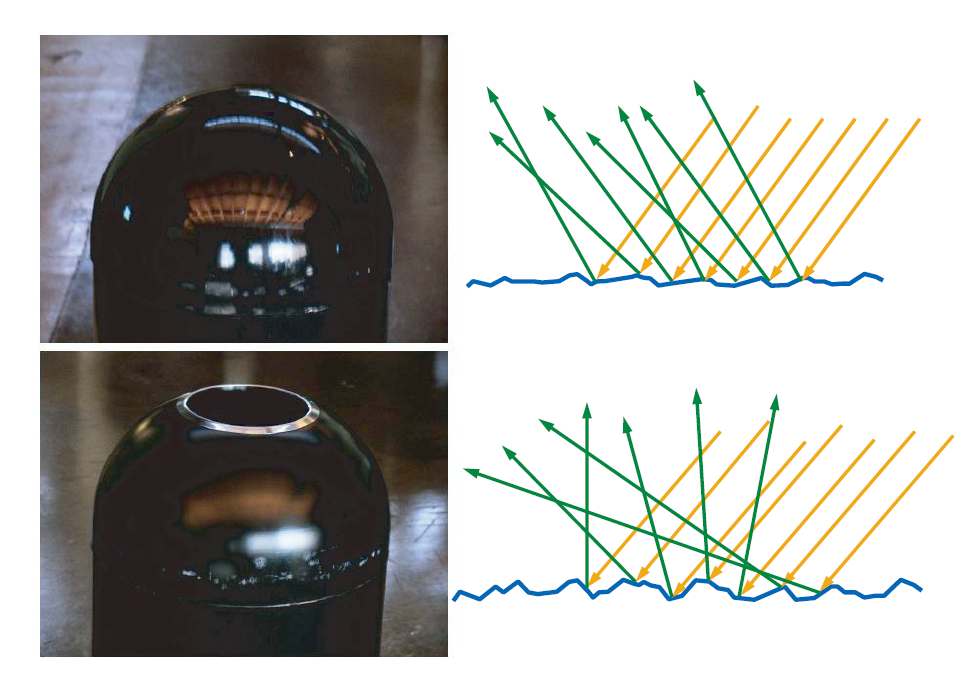

出于着色的目的，我们通常会使用统计方法去处理这种微观几何现象，并视为表面上的点在多个方向上反射和折射光线。

有关微观几何对反射率影响的数学分析，被称为微表面理论（microfacet theory），许多 BRDF 模型都是建立在这个理论之上的。这个工具最初是由光学界的研究人员提出的，1977 年由 Blinn引入了计算机图形学，1981 年由 Cook 和 Torrance 再次引入。

该理论的基础是，将微观几何建模为一组微表面的集合。每个微表面都是平坦的，它具有一个微表面法线 $m$ ；这些微表面会根据 micro-BRDF $f_\mu(l,v,m)$ 来对光线进行分别反射，将所有微表面的反射率加起来，就是整个表面的 BRDF。通常的做法是将每个微表面都当成一个完美的菲涅尔镜面，这会产生镜面的微表面 BRDF，用于模拟表面反射。

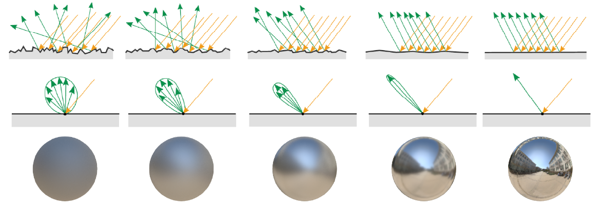
图 微平面粗糙度对材质外观的影响。（图片来自Moving Frostbite to PBR，SIGGRAPH 2014）

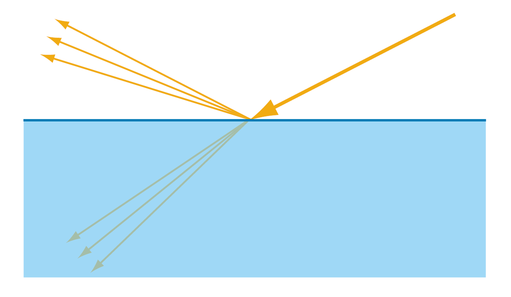

对于反射光线，它的行为很好理解，但是折射进表面的光会发生什么变化呢？这取决于物质本身的特性

- 对于 **金属** ,折射光会立刻被吸收，这是因为金属中有大量的自由电子。

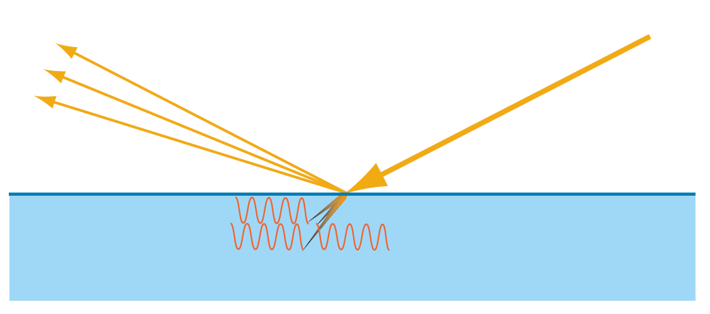

- 对于**非金属**（电介质或者绝缘体），一旦光在其内部折射，就表示为常规的参与介质，表现出吸收和散射两种行为。

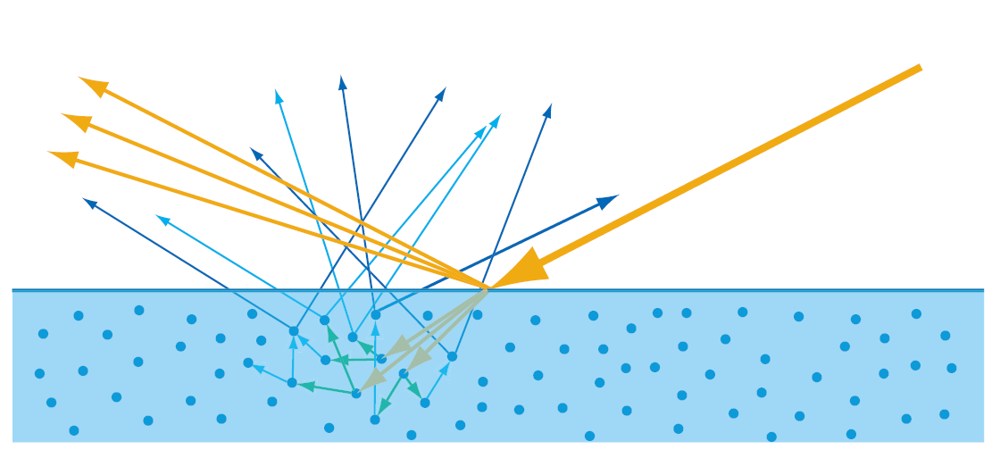

---

## 漫反射和次表面散射本质相同

漫反射本质也是折射光的次表面散射的结果。唯一的区别是观察尺度，如果散射距离相对于观察尺度（像素采样大小）的大小非常小，那么次表面散射可以直接近似为漫反射。

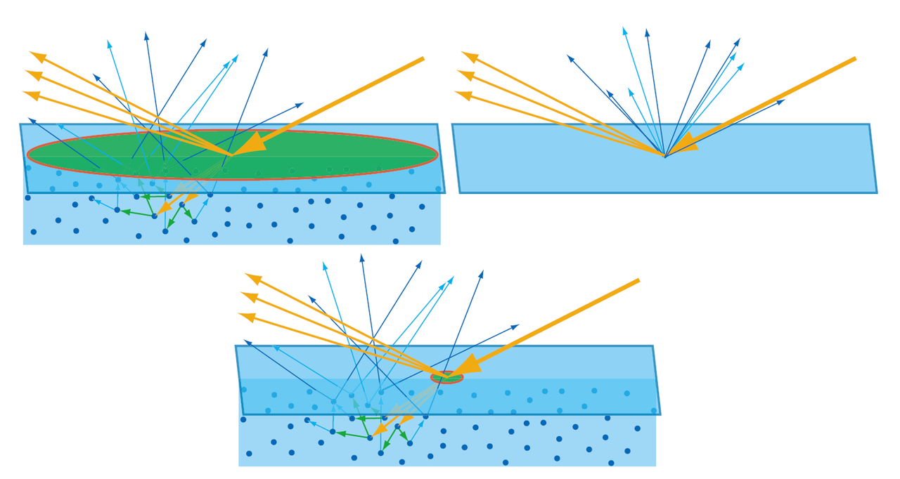

# 能量守恒

## 渲染方程（The Rendering Equation）

渲染方程描述了光能在场景中的流动，是渲染中的不可感知方面的最抽象的表示。根据光学的物理学原理，渲染方程在理论上给出了一个完美的解，而各种各样的渲染技术，只是这个理想结果的近似。

对于某一点的渲染方程，可以表示为

$$L_o = L_e + \int_{\Omega} f_r \cdotp L_i \cdotp (\omega_i\cdot n)\cdot d\omega_i$$

- $L_o$ 是p点的出射光亮度。
-  $L_e$ 是p点发出的光亮度。
- $f_r$ 是p点入射方向到出射方向光的反射比例，即BxDF，一般为BRDF。
- $L_i$ 是p点入射光亮度。
- $(\omega_i \cdotp n)$ 是入射角带来的入射光衰减
- $\int_{\Omega} ...d w_i$ 是入射方向半球的积分。

在实时渲染中，我们常用的反射方程（The Reflectance Equation）则是渲染方程的一个简化版本，或者说一个特例。

$$L_o =\int_{\Omega} f_r \cdotp L_i \cdotp (\omega_i \cdotp n) \cdotp d \omega_i$$


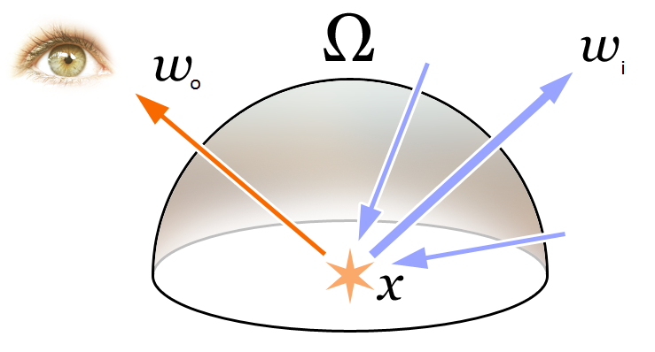

## 能量守恒

概念：出射光线的能量 永远不大于 入射光线的能量

表现：随着粗糙度的上升镜面反射区域的面积会增加，作为平衡，镜面反射区域的平均亮度则会下降。

如何确保能量守恒？

使用反射方程：  

$$L_o =\int_{\Omega} f_r \cdotp L_i \cdotp (\omega_i \cdotp n) \cdotp d \omega_i$$ 
简单理解：出射光线强度 = 入射光强度 * 入射角度衰减 * 反射比例
- $L_i$ ：入射光强度
- $(\omega_i \cdotp n)$ : 入射角度带来的入射光衰减
- $f_r$ : 反射比例

如何求反射比例？：BRDF !

## BxDF

BxDF 一般而言是对BRDF、BTDF、BSDF、BSSRDF等几个双向分布函数的一个统一表示。
其中，BSDF可以看作BRDF和BTDF更一般的形式，而且BSDF = BRDF + BTDF。
BSSRDF和BRDF的不同之处在于，BSSRDF可以指定不同的光线入射位置和出射位置。
BRDF最为简单，也最为常用。因为游戏和电影中的大多数物体都是不透明的，用BRDF就完全足够。而BSDF、BTDF、BSSRDF往往更多用于半透明材质和次表面散射材质。

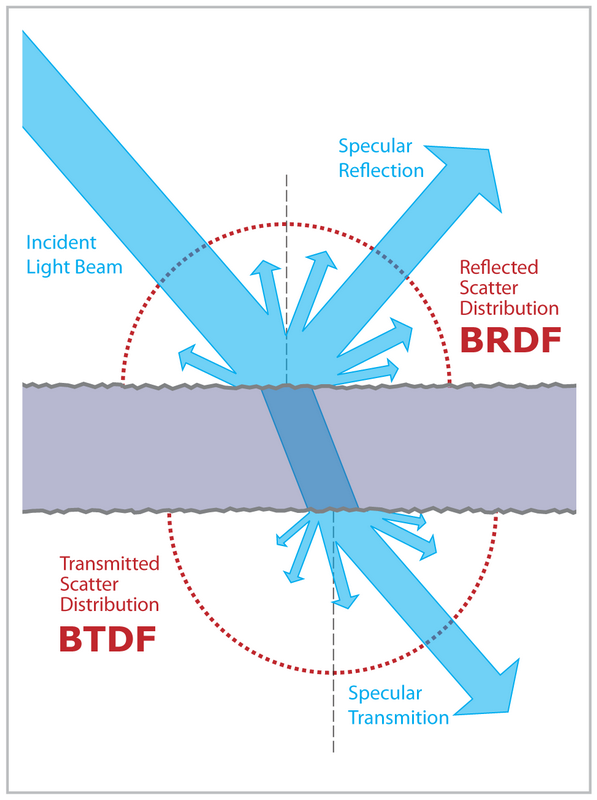

## BRDF（Bidirectional Reflectance Distribution Function）

[Wikipedia](https://en.wikipedia.org/wiki/Bidirectional_reflectance_distribution_function) 

双向分布反射函数，$f_r(\omega_i,\omega_r)$ 是四个实变量的函数，用于定义光源的光如何从不透明表面反射。每个方向 $\omega$ 由天顶角和方位角确定，所以是四个参数的函数。BRDF描述了出射光方向的radiance和入射到表面的irradiance的比例。  
值得一提的是，图形学中的BRDF通常来说应该是SVBRDF（Spatially Varying Bidirectional Reflectance Distribution Function）或者SBRDF（Spatially Bidirectional Reflectance Distribution Function），即 $f_r(\omega_i,\omega_r, x)$ ， $x$ 是物体表面的2D位置。

严格来说，同样使用 $\omega_i$ 和 $\omega_o$ 作为输入参数的Blinn-Phong 光照模型也被人认为一个BRDF模型，但是 Blinn-Phong 模型并没有遵循能量守恒定律，因此它不是基于物理的渲染。

### 基于物理的BRDF
基于物理的BRDF还有一些性质：
1. BRDF的值总是大于等于零的
2. 遵从亥姆霍兹光路可逆性（Helmholtz Recoprpcity Rule），即光路相反值不变。
3. 能量守恒，对于所有的BRDF的在整个球面的积分总是小于1
4. 线性特征，表面上某一点的全部反射辐射度可以简单地表示为各BRDF反射辐射度之和
# Cook-Torrance 反射率方程

现在有好几种BRDF都能得出对于物体表面对于光的反应，但是几乎所有实时渲染管线都是使用的同一套模型： Cook-Torrance BRDF 模型。

$$f_r = k_d f_{lambert} + k_s f_{cook-torrance}$$

Cook-Torrance BRDF 模型兼有漫反射和镜面反射两个部分， $k_d$ 就是入射光线中的折射部分占的比例，而 $k_s$ 是反射部分的比例。
其中， $f_{lambert} = \frac{c}{\pi}$ ，表示的是表面颜色，除以 $\pi$ 是为了对漫反射进行归一化，因为BRDF的积分方程受 $\pi$ 影响。

目前存在着许多不同类型的模型来实现BRDF的漫反射部分，大多看上去都相当真实，但是相应的运算开销也非常的昂贵。不过按照Epic公司给出的结论，Lambertian漫反射模型已经足够应付大多数实时渲染的用途了。

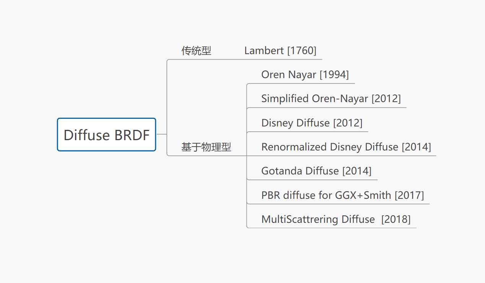

而镜面反射 $f_{cook-torrance}$ 则更加高级一些，形式如下：

$$f_{cook-torrance} = \frac {DFG}{4(\omega_o \cdotp n)(\omega_i \cdotp n)}$$

Cook-Torrance BRDF的镜面反射部分包含三个函数，此外分母部分还有一个标准化因子 。字母D，F与G分别代表着一种类型的函数，各个函数分别用来近似的计算出表面反射特性的一个特定部分。三个函数分别为法线分布函数(Normal **D**istribution Function)，菲涅尔方程(**F**resnel Rquation)和几何函数(**G**eometry Function)：
- **法线分布函数**：估算在受到表面粗糙度的影响下，朝向方向与半程向量一致的微平面的数量。这是用来估算微平面的主要函数。
- **几何函数** ：描述了微平面自成阴影的属性。当一个平面相对比较粗糙的时候，平面表面上的微平面有可能挡住其他的微平面从而减少表面所反射的光线。
- **菲涅尔方程**：菲涅尔方程描述的是在不同的表面角下表面所反射的光线所占的比率。
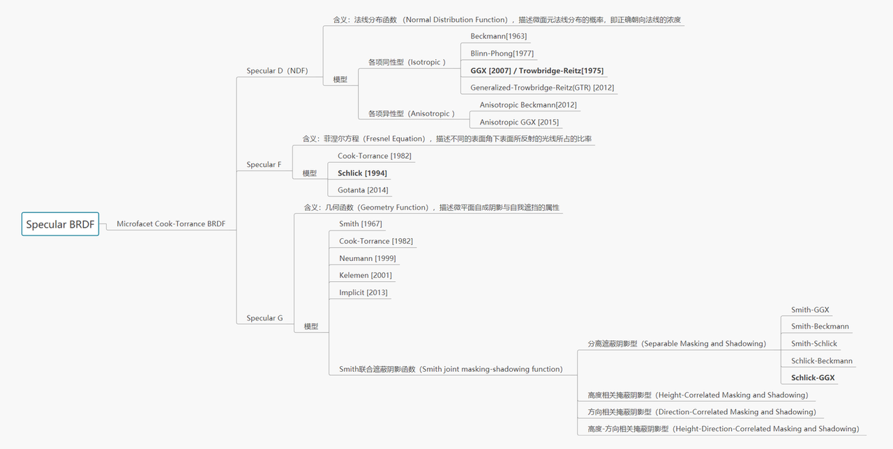

## 法线分布函数

法线分布函数D表明的是从统计学上近似的表示的与向量相同方向的微平面的比率。目前有很多NDF都可以从统计学上估算微平面的总体取向度，只要给定一些粗糙度的参数。我们在这里要用到的是Trowbridge-Reitz GGX:

$$NDF_{GGXTR}(n,h,\alpha) = \frac{\alpha^2} {\pi((n \cdotp h)^2(\alpha^2 -1)+1)^2}$$

其中， $n$ 是表面法线， $h$ 是半程向量， $\alpha$ 是表面粗糙度。

我们可以得到如下结果

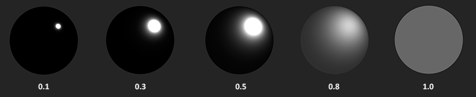

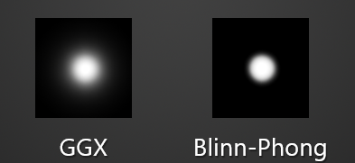

当粗糙度很低（也就是说表面很光滑）的时候，与半程向量取向一致的微平面会高度集中在一个很小的半径范围内。由于这种集中性，NDF最终会生成一个非常明亮的斑点。但是当表面比较粗糙的时候，微平面的取向方向会更加的随机。你将会发现与_h_向量取向一致的微平面分布在一个大得多的半径范围内，但是同时较低的集中性也会让我们的最终效果显得更加灰暗。

```GLSL
float D_GGX_TR(vec3 N, vec3 H, float a){
    float a2     = a*a;
    float NdotH  = max(dot(N, H), 0.0);
    float NdotH2 = NdotH*NdotH;

    float nom    = a2;
    float denom  = (NdotH2 * (a2 - 1.0) + 1.0);
    denom        = PI * denom * denom;

    return nom / denom;
}
```


## 几何函数

几何函数从统计学上近似的求得了微平面之间互相遮蔽的比例，这种相互遮蔽会损耗光线的能量。与NDF类似，几何函数使用一个材料的粗糙度参数作为输入参数，粗糙度较高的表面的微平面相互遮蔽的概率就越高。

关于几何函数的详细论述，见[毛星云PBR白皮书（5）：几何函数总结](https://zhuanlan.zhihu.com/p/81708753)

我们使用的是GGX和 Schlick-Beckmann 近似的结合体，因此也称为 Schlick-GGX

$$G_{SchlickGGX}（n,v,k）= \frac{n \cdotp v}{(n \cdotp v)(1-k)+k}$$
其中 ，$k_{direct} = \frac{(\alpha + 1)^2}{8}$ ，直接光照。  $k_{IBL} = \frac{\alpha^2}{2}$ ，屏幕空间光照。

为了有效的估算几何部分，需要将观察方向（几何遮蔽(Geometry Obstruction)）和光线方向向量（几何阴影(Geometry Shadowing)）都考虑进去。我们可以使用史密斯法(Smith’s method)来把两者都纳入其中：

$$G(n,v,l,k)= G_{sub}(n,v,k)G_{sub}(n,l,k)$$

可以得到这样的效果。

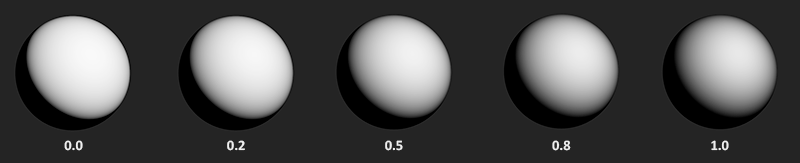

几何函数是一个值域为[0.0, 1.0]的乘数，其中白色或者说1.0表示没有微平面阴影，而黑色或者说0.0则表示微平面彻底被遮蔽。

```GLSL
float GeometrySchlickGGX(float NdotV, float k){
    float nom   = NdotV;
    float denom = NdotV * (1.0 - k) + k;

    return nom / denom;
}

float GeometrySmith(vec3 N, vec3 V, vec3 L, float k){
    float NdotV = max(dot(N, V), 0.0);
    float NdotL = max(dot(N, L), 0.0);
    float ggx1 = GeometrySchlickGGX(NdotV, k);
    float ggx2 = GeometrySchlickGGX(NdotL, k);

    return ggx1 * ggx2;
}
```

## 菲涅尔方程

菲涅尔（发音为Freh-nel）方程描述的是被反射的光线对比光线被折射的部分所占的比率，这个比率会随着我们观察的角度不同而不同。当光线碰撞到一个表面的时候，菲涅尔方程会根据观察角度告诉我们被反射的光线所占的百分比。利用这个反射比率和能量守恒原则，我们可以直接得出光线被折射的部分以及光线剩余的能量。

当垂直观察的时候，任何物体或者材质表面都有一个基础反射率(Base Reflectivity)，但是如果以一定的角度往平面上看的时候所有反光都会变得明显起来。你可以自己尝试一下，用垂直的视角观察你自己的木制/金属桌面，此时一定只有最基本的反射性。但是如果你从近乎90度（译注：应该是指和法线的夹角）的角度观察的话反光就会变得明显的多。如果从理想的90度视角观察，所有的平面理论上来说都能完全的反射光线。这种现象因菲涅尔而闻名，并体现在了菲涅尔方程之中。

菲涅尔方程是一个相当复杂的方程式，它本质上是麦克斯韦方程组的一个特殊解。不过幸运的是菲涅尔方程可以用Fresnel-Schlick近似法求得近似解：

$$F_{Schlick}(h,v,F_0) = F_0 + (1-F0)(1-(h \cdotp v))^5$$

$F_0$ 表示平面的基础反射率，它是利用所谓的折射指数（Indices of Refraction ,IOR）计算得出的。然后正如下图所示，我们朝这略射角的方向上看时，反光越来越强。

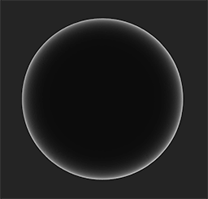


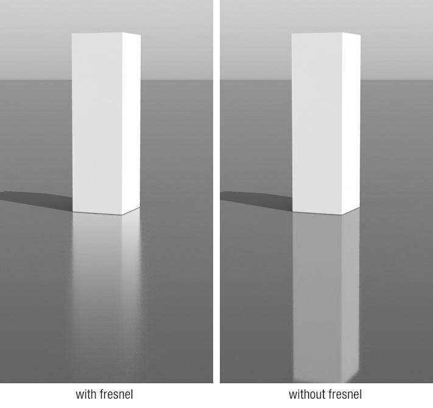

但是有一个问题：Fresnel-Schlick 近似仅仅是对非金属表面做了定义，对于金属表面，我们不能通过计算得出 $F_0$ 所以通常，我们会预计算出 $F_0$ 使用一张纹理存储。

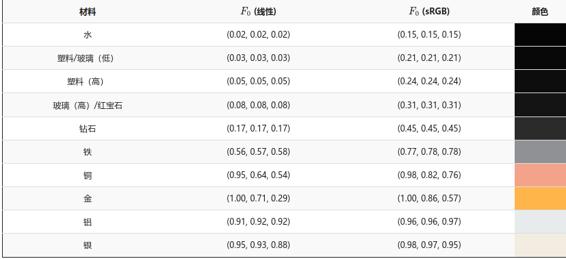
## 完整公式


$$L_o(p,\omega_o) = \int_\Omega (k_d \frac{c}{\pi}+k_s \frac{DFG}{4(\omega_o \cdotp n)(\omega_i\cdotp n)})L_i(p,\omega_i) n \cdotp \omega_{i} d \omega_i$$

# 迪士尼原则的BxDF

基于物理的渲染（Phyasically Based Rendering )技术，自从迪士尼在SIGGRAPH 2012上提出了著名的“迪士尼原则的BRDF（Disney Principled BRDF）后，由于高度的易用性和方便的的工作流，已经被电影和游戏业界广泛使用。

迪士尼动画工作室则是这次PBR革命的重要推动者。迪士尼的Brent Burley于SIGGRAPH 2012上进行了著名的talk《Physically-based shading at Disney》，提出了迪士尼原则的BRDF（Disney Principled BRDF）， 由于其高度的通用性，将材质复杂的物理属性，用非常直观的少量变量表达了出来（如金属度metallic和粗糙度roughness），在电影业界和游戏业界引起了不小的轰动。从此，基于物理的渲染正式进入大众的视野。

## 迪士尼原则的BRDF

在2012年迪士尼原则的BRDF被提出之前，基于物理的渲染都需要大量复杂而不直观的参数，此时PBR的优势，并没有那么明显。在2012年迪士尼提出，他们的**着色模型是艺术导向（Art Directable）的，而不一定要是完全物理正确（physically correct）的** ，并且对微平面BRDF的各项都进行了严谨的调查，并提出了清晰明确而简单的解决方案。

迪士尼原则的BRDF（Disney Principled BRDF）核心理念如下：

1. 应使用直观的参数，而不是物理类的晦涩参数。
2. 参数应尽可能少。
3. 参数在其合理范围内应该为0到1。
4. 允许参数在有意义时超出正常的合理范围。
5. 所有参数组合应尽可能健壮和合理。

以上五条原则，很好地保证了迪士尼原则的BRDF的易用性。

### Disney Principled BRDF参数

以上述理念为基础，迪士尼动画工作室对每个参数的添加进行了把关，最终得到了一个颜色参数（baseColor）和下面描述的十个标量参数：

- **baseColor（基础色）**：表面颜色，通常由纹理贴图提供。
- **subsurface（次表面）**：使用次表面近似控制漫反射形状。
- **metallic（金属度）**：金属（0 =电介质，1=金属）。这是两种不同模型之间的线性混合。金属模型没有漫反射成分，并且还具有等于基础色的着色入射镜面反射。
- **specular（镜面反射强度）**：入射镜面反射量。用于取代折射率
- **specularTint（镜面反射颜色）**：对美术控制的让步，用于对基础色（base color）的入射镜面反射进行颜色控制。掠射镜面反射仍然是非彩色的。
- **roughness（粗糙度）**：表面粗糙度，控制漫反射和镜面反射。
- **anisotropic（各向异性强度）**：各向异性程度。用于控制镜面反射高光的纵横比。（0 =各向同性，1 =最大各向异性）
- **sheen（光泽度）**：一种额外的掠射分量（grazing component），主要用于布料。
- **sheenTint（光泽颜色）**：对sheen（光泽度）的颜色控制。
- **clearcoat（清漆强度）**：有特殊用途的第二个镜面波瓣（specular lobe）。
- **clearcoatGloss（清漆光泽度）**：控制透明涂层光泽度，0 =“缎面（satin）”外观，1=“光泽（gloss）”外观。

每个参数的效果的渲染示例如下图所示。

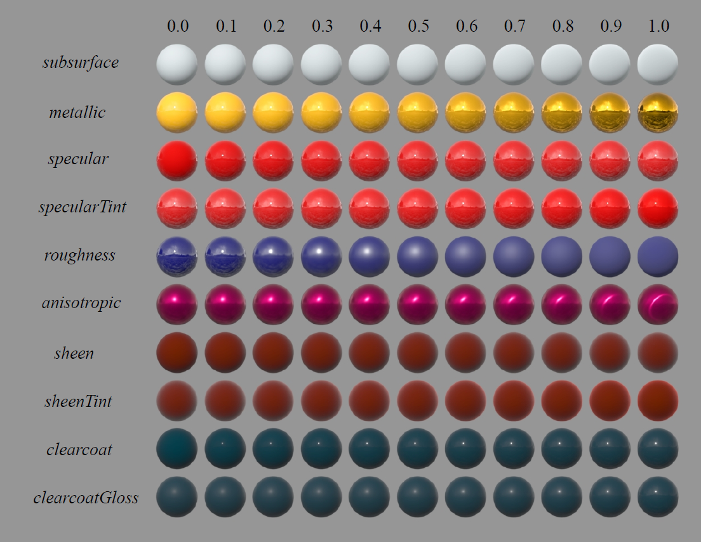

## Disney Principled BSDF

随后的2015年，迪士尼动画工作室在Disney Principled BRDF的基础上进行了修订，提出了Disney Principled BSDF [Extending the Disney BRDF to a BSDF with Integrated Subsurface Scattering, 2015]。

以下是开源三维动画软件Blender实现的Disney Principled BSDF的图示：

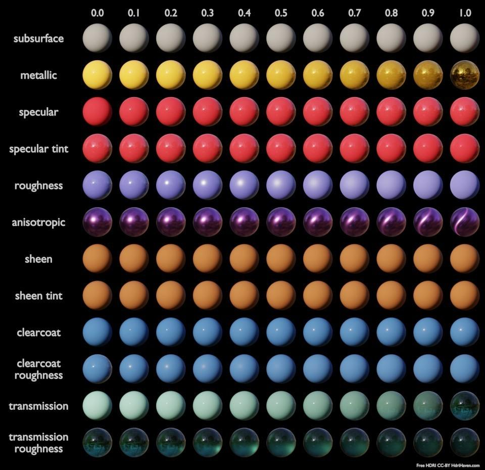

