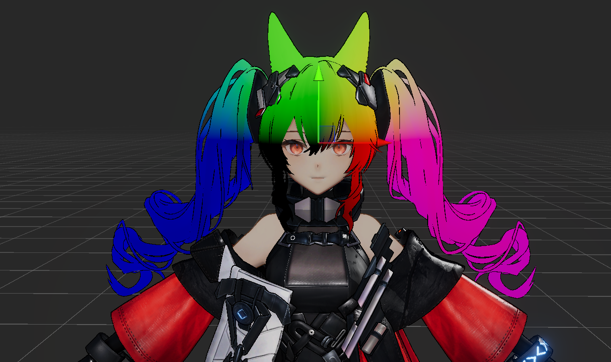

# 前言

PBR在12年提出了Disney Principled BRDF，以简洁且一致的工作流和强大的表现效果被各大引擎和DCC快速支持，并成为了业界公认的标准。本文将依据Disney 发表的论文 [Physically-Based Shading at Disney](https://disneyanimation.com/publications/physically-based-shading-at-disney/) ，作Disney Principled BRDF的一个简要笔记并使用HLSL语言实现。

本人才疏学浅，如有错误，敬请指正，本人不胜感激。

# DisneyBRDF 的来源

Disney BRDF 使用的是 微表面模型，即

$$
f(l,v) = diffuse + \frac{D(\theta_h)F(\theta_d)G(\theta_l,\theta_v)}{4 \cos\theta_l\cos\theta_v}
$$

其中，diffuse未知，通常用 lambert 模型表述，而高光项则包含 $D$,$F$,$G$ 三项，分别表示法线分布函数，菲涅尔反射系数，几何遮蔽函数。

关于 $h$ ，即半角向量，虽然在运算中，它仅仅是 $lightDir$, $viewDir$ 之和的归一化向量（即$\frac{l + v}{ |l + v| }$）。但它有着更深刻的含义：如果给定光线方向 $l$ 和视线方向 $v$ 能够发生镜面反射，说明存在微表面，且这些微表面的法线与半角向量 $h$ 的方向相同。所以对于 $D$ 项，我们使用半角向量而不是 pixel 的 normal。

值得一提的是，Disney 指出： 对于未明确采用微表面模型的PBR，仍可以解读为微表面模型，只要包含 $D$ ，$F$ 项以及可以被看作 $G$ 项的某种因子。微表面模型与别的模型的最大区别是是否显式地包含 $\frac{1}{4 cos\theta_l cos\theta_v}$ 。对于未包含该因子的模型，可通过提取D和F因子后，将模型乘以 $4cos\theta_lcos\theta_v$ 来推导其隐含的阴影因子。

Disney使用了 "MERL 100" 数据库记录的材质数据和DisneyBRDF进行比较，以确保自己的材质是真实可信的。"MERL 100"记录了100个各向同性的材质，详细记录了他们的数据。Disney 对于MERL100数据库的观察我们不提，可以参考毛星云大神的文章[【基于物理的渲染（PBR）白皮书】（三）迪士尼原则的BRDF与BSDF相关总结](https://zhuanlan.zhihu.com/p/60977923)。

# Disney “principled” BRDF 解析与实现

## diffuse

diffuse是次表面散射的一个抽象/简化，所以很多模型会加上菲涅尔项使其更加物理，disney的公式形似：

$$(1 − F(\theta_l))(1 − F(\theta_d ))$$

使用两个菲涅尔是为了保持Helmholtz互易（即光路可逆性）。

$$f_d = \frac{baseColor}{\pi}(1+F_{D90}-1)(1-\cos\theta_l)^5(1 + (F_D90-1)(1-\cos\theta_v)^5)$$

$$F_{D90} = 0.5 + 2 roughness \cos^2\theta_d $$

$\theta_d$ 是光线和半角向量的夹角。

这个模型和MERL100拟合的相当优秀，并且艺术友好。

次表面项使用另一个diffuse模型进行拟合，不过由于并不是真正的模拟光的次表面散射，所以表现能力只能说聊胜于无，完整的次表面散射应该参考2015年的Disney BSDF，不过这就不是实时渲染的话题了。

## D

基于对于多个模型的观察，尤其是GGX（Trowbridge-Reitz）分布和Berry分布。Disney在这篇文章中提出了GTR（Generalized-Trowbridge-Reitz）模型。$$D_{GTR}= c/(\alpha^2\cos^2\theta_h+\sin^2\theta_h)^\gamma$$

补：完整公式为： $$D_{GTR}(\theta_h) = \frac{(\gamma-1)(\alpha^2-1)}{\pi(1-(\alpha^2)^{1-\gamma})} \frac{1}{(1 + (\alpha^2-1)\cos^2\theta_h)^\gamma}$$$$\phi_h = 2\pi\xi_1$$

$$\cos\theta_h = \sqrt{\frac{1-[(\alpha^2)^{1-\gamma}(1-\xi_2)+\xi_2]^{\frac{1}{1-\gamma}}}{1-\alpha^2}}$$ 其中，$\xi$ 为采样随机数， $\phi_h$ 为 半角的角度。

  

>碎碎念：现在连希腊字母都不会念了，高中学的物竞都还给老师了，唉

  
  

- 当 $\gamma$ 为2时等效GGX，$\gamma$ 为1时等效Berry分布，当 $\gamma$ 为10时，拟合到Beckmann分布。随着$\gamma$的增大，高光尾部逐渐缩短。

- D项使用了两个Specular lobe，主波瓣使用GTR2（GGX），副波瓣（清漆层）使用GTR1。并且主波瓣支持各向异性和金属，而副波瓣不支持。

- 使用$a = roughness^2$ 映射，达到更好的线性变化的外观。

关于缩放常数c，为了满足能量守恒，因此整个函数应当积分为1，需要一个常数C缩放，对于不同的 $\gamma$ 会有不同的C，可以自己积分得出（我不会算*）。

## F

经典的Schlick近似。

$$F_{Schlick} = F_0 + (1 − F_0 )(1 − cosθ_d)^5$$

## G

没有被masking和shadowing的比例。不完全物理，参考了艺术家的意见进行了修改。

  

# 开发经验

材质可以在不同的环境下进行一致的响应。艺术家们可以实时编辑所有参数并立刻看到结果，并且可以获得和最终的展示效果一样的模型，这使得艺术家无需在照明阶段返工，并获得了一致的高质量渲染结果。统一模型还带来了一个优势：可以通过保存一组参数预设来获得一个简单的材质库。

# Other

- 微表面分布函数 $D(\theta_h)$是关于半角向量 h 的分布函数。

- 为了保持物理合理性，其在半球上的投影面积积分必须为 1： $\int_{\Omega} D(\theta_h) \cos \theta_h \, d\omega = 1$ 即积分考虑了 $\cos \theta_h​$ 的投影因子。

- 为了重要性采样（importance sampling），可以将采样概率密度函数选为：$\text{pdf}_h = D(\theta_h) \cos \theta_h$ 。（我也不会算）

- 各向异性的0.9主要用于限制了长宽比为 10:1

- sheen由一个额外的BRDF lobe模拟。

# Implementation

我参考[Disney BRDF Explorer 的官方实现](https://github.com/wdas/brdf/blob/main/src/brdfs/disney.brdf) Copy 了一份HLSL实现:[DisneyBRDF](https://github.com/FOTH0626/FothUrpShaderTemplate/blob/main/DisneyBRDF.hlsl).   
碎碎念一下: 一开始我的实现用了 `PI` 这个宏，这个宏被Unity定义过，所以引入到Unity Shader中就会报错，然后用了 `const float MY_PI = 3.1415926535` 一个const变量，结果引入到UnityShder后不知道为什么 `MY_PI` 变成0了，搞的整个材质爆白，我还挂着Bloom给我闪瞎了，瞎试了半天才想到抓帧才发现这个离谱Bug（）。最后又用回宏 `#define MY_PI ` 怀疑是Shaderlab的问题（总之fuck Unity），以后有时间探究一下底层实现（）。

洁尔佩塔的衣服使用了DisneyBRDF。（头发是我在调球壳法线，无视就好）