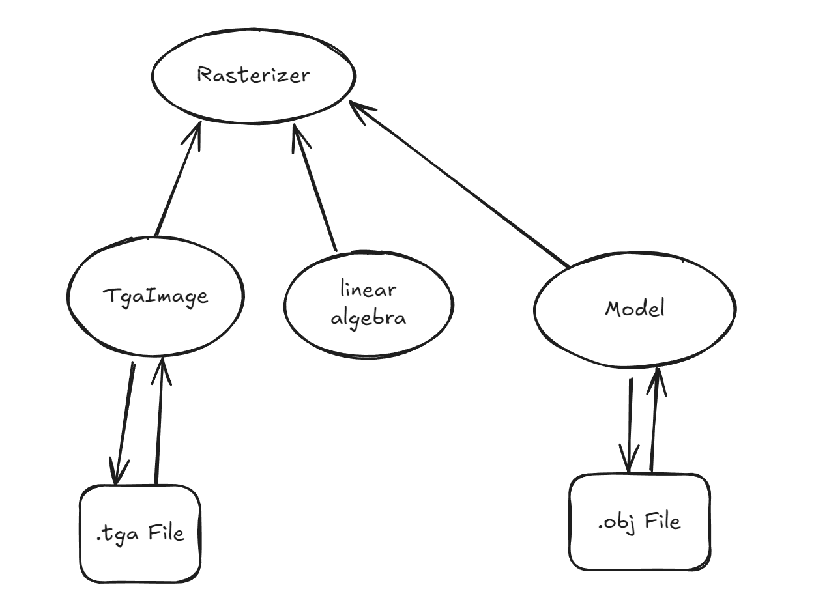
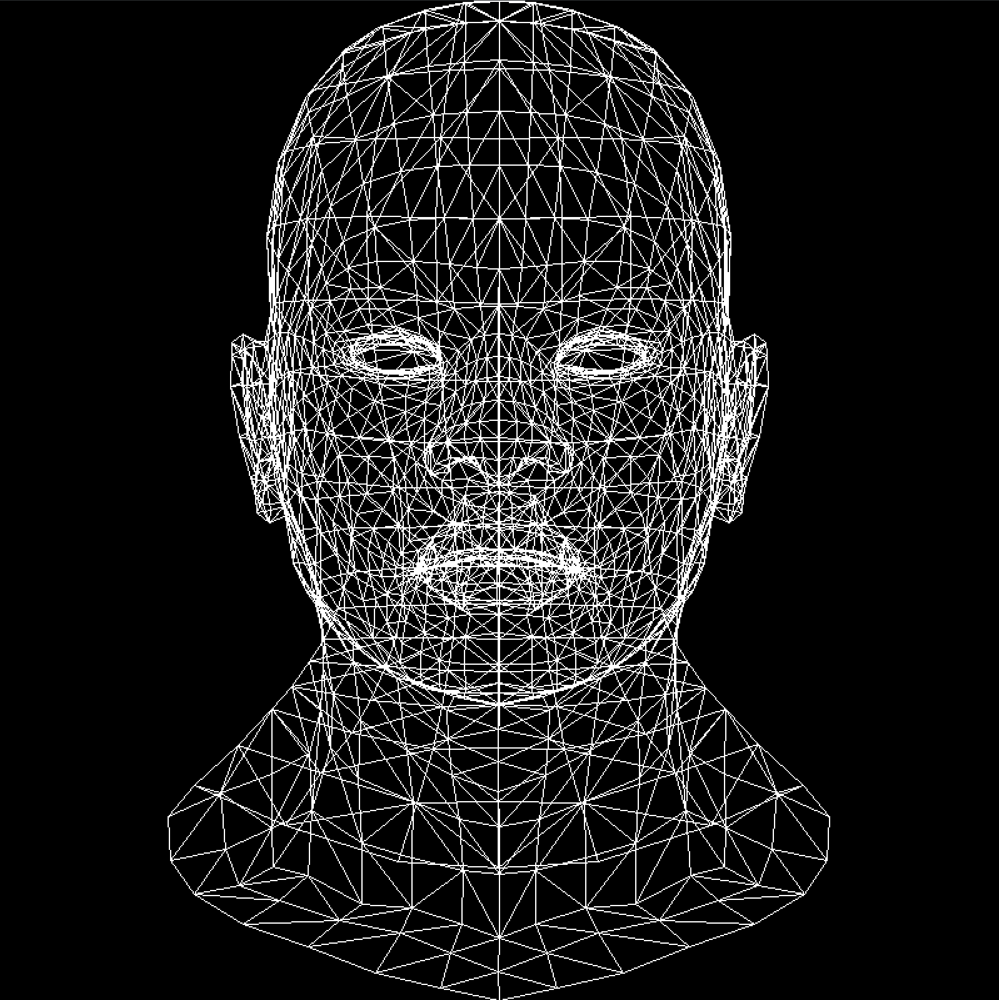

# 前言
本人打算提高个人的C++基础编程水平和图形学理解，所以再再再次启动了[tinyrenderer](https://github.com/ssloy/tinyrenderer)的程序编写，相较于之前被动的抄写代码，我准备选择直接观察他的代码结果后根据自己的理解进行编写，并进行结果比较。
开始编写前，思考出如图所示的基础架构（如果这可以称为架构的话）
项目结构如下
```txt
.
├── CMakeLists.txt
├── geometry.cpp
├── geometry.h
├── main.cpp
├── model.cpp
├── model.h
├── obj
│   └── african_head.obj
├── rasterizer.cpp
├── rasterizer.h
├── README.md
├── sandbox.cpp
├── tgaimage.cpp
└── tgaimage.h
```
源码可以在[这里](https://github.com/FOTH0626/myLittleRenderer/tree/51ee96966ca9b34c1c311414ce73846cd04d1103)看到
tgaimage.h和tgaimage.cpp复制自ssloy的初始提交，可以在lesson01的wiki看到，在此不多赘述。
# 基础设施建设
## 向量类
在GAMES101的作业中，使用了线性代数库 `Eigen`，但是对于本环境的代码来说，并不需要这么强大的功能，所以参考原仓库手搓了一份向量类
```C++
template <typename T>  
struct Vec2{  
    union{  
        struct{T x, y;};  
        struct{T u, v;};  
    };  
    Vec2(): x(0), y(0) {}  
    Vec2(T _x, T _y): x(_x), y(_y) {}  
};

template <typename T>  
struct Matrix4{  
    std::array<T,16> data;  
    Matrix4():data({0}){}  
    T get_index(int i, int j) const{  
        return data[i * 4 + j];  
    }      
    Matrix4(std::initializer_list<T> list) requires requires{list.size() == 16;}{  
        int i = 0;  
        for(auto it = list.begin(); it != list.end(); it++){  
            data[i++] = *it;  
        }  
    }  
};
```
仅做举例，关于重载运算符等操作不多赘述。  
其中，使用 `union` 内的 匿名 `struct` 达到了`.x` 与`.u` 访问同一内存的效果。
`Matrix4(std::initializer_list<T> list) requires requires{list.size() == 16;` 的写法来自软研C++组的支持， `requires requires{list.size() == 16}` 表明在构造函数时必须调用一个16个元素的列表。  
`Matrix` 结构体尚未经过测试，可能存在bug。
## Model类
## 头文件定义

```C++
class Model{  
  public:  
    Model() = delete;  
    explicit Model(const std::string& filename);  
    [[nodiscard]] std::vector<Vec3f> getVerts() const {return verts_;}  
    [[nodiscard]] std::vector<Vec2f> getUV() const {return uv_;}  
    [[nodiscard]] std::vector<Vec3f> getNorms() const {return norms_;}  
    [[nodiscard]] std::vector<std::array<std::array<unsigned short,3>
, 3>> getFaces() const {return faces_;}  
  private:  
    std::vector<Vec3f> verts_;  
    std::vector<Vec2f> uv_;  
    std::vector<Vec3f> norms_;  
    std::vector<std::array<std::array<unsigned short,3>, 3>> faces_;  
  
};
```
wavefront obj 文件是由wavefront 公司所创建的模型格式，受到各类建模软件的广泛支持。该模型会在行首声明数据类型
- v代表vertice，顶点
- vt 代表vertice texcoord，纹理坐标
- vn代表nromal，法线
- f代表face，即面  
face应该是最特殊的行数，下面是一个示例
```txt
f 321/304/321 318/302/318 147/127/147  
f 456/446/456 321/304/321 525/517/525  
f 456/446/456 525/517/525 457/447/457  
``` 
数据每一行分成了三部分，每一部分都代表了一个顶点数据，分别代表顶点索引，贴图索引和法线索引，即
```txt
vert/texture/normal   vert/texture/normal   vert/texture/normal
```
所以使用了 `std::vector<std::array<std::array<unsigned short, 3>, 3>>` 这种臃肿的数据结构。
## 构造函数
```c++
Model::Model(const std::string &filename) {  
  std::ifstream file(filename);  
  if ( !file.is_open()) {  
    std::cerr << "Error opening file " << filename << std::endl;  
    return;  
  }  
  std::string line;  
  while (std::getline(file, line)){  
    std::istringstream iss(line);  
    std::string type;  
    iss >> type;  
    if(type == "v") {  
      Vec3f v;  
      iss >> v.x >> v.y >> v.z;  
      verts_.push_back(v);  
    }else if(type == "vt"){  
        Vec2f vt;  
        iss >> vt.x >> vt.y;  
        uv_.push_back(vt);  
    }  
    else if (type == "vn"){  
        Vec3f vn;  
        iss >> vn.x >> vn.y >> vn.z;  
        norms_.push_back(vn);  
    }  
    else if (type == "f"){  
      std::array<std::array<unsigned short, 3>, 3> face{};  
      char slash;  
      for (int i = 0; i < 3; i++) {  
        iss >> face[i][0] >> slash >> face[i][1] >> slash >> face[i][2];  
      }  
      faces_.push_back(face);  
    }  
  
  }  
  file.close();  
  std::cout << "Loaded" << verts_.size() << " vertices" << std::endl;  
  std::cout << "Loaded" << uv_.size() << " uv" << std::endl;  
  std::cout << "Loaded" << norms_.size() << " normals" << std::endl;  
  std::cout << "Loaded" << faces_.size() << " faces" << std::endl;  
  
}
```
构造函数会打开文件后按行读取，根据行首的类型压入对应的动态数组，并在读取完后输出消息读取数量。（不知道为什么，switch语句不支持string类型，所以使用连续的 `ifelse` 进行逻辑判断。）
# 布雷森汉姆直线算法
布雷森汉姆的核心思想是通过整形的计算代替浮点数的计算，获得更好的性能。  
对于斜率大于1或斜率为负数这类情况，布雷森汉姆算法会交换起始点，由x步进改为y步进等方法保证适用于各种情况。算法实现来自GAMES101的作业实现。
```C++
void line(const Vec2i p1, const Vec2i p2, TGAImage &image,
		  const TGAColor& color) {  
  int x1 = p1.x;  
  int y1 = p1.y;  
  int x2 = p2.x;  
  int y2 = p2.y;  
  
  int x, y, xe, ye ;  
  int dx = x2 - x1;  
  int dy = y2 - y1;  
  int dx1 = std::abs(dx);  
  int dy1 = std::abs(dy);  
  int px = 2 * dy1 - dx1;  
  int py = 2 * dx1 - dy1;  
    if (dy1 <= dx1) {  
      if (dx >= 0) {  
        x = x1;  
        y = y1;  
        xe =x2;  
      }else {  
        x =x2;  
        y = y2;  
        xe = x1;  
      }  
      image.set(x, y, color);  
      for (int i = 0; x < xe; i++) {  
        x = x + 1;  
        if (px < 0) {  
          px = px + 2 * dy1;  
        }else {  
          if ((dx < 0 && dy < 0) || (dx > 0 && dy > 0)) {  
            y = y + 1;  
          }else {  
            y = y - 1;  
          }  
          px = px + 2 * (dy1 - dx1);  
        }  
        image.set(x, y, color);  
      }  
    }else {  
      if (dy >= 0) {  
        x = x1;  
        y = y1;  
        ye = y2;  
      }else {  
        x = x2;  
        y = y2;  
        ye = y1;  
      }  
      image.set(x, y, color);  
      for (int i = 0; y < ye; i++) {  
        y = y + 1;  
        if (py <= 0) {  
          py = py + 2 * dx1;  
        }else {  
          if ((dx < 0 && dy < 0) || (dx > 0 && dy > 0)) {  
            x = x + 1;  
          }else {  
            x = x - 1;  
          }  
          py = py + 2 * (dx1 - dy1);  
        }  
        image.set(x, y, color);  
      }  
    }  
}
```
# 绘图
此时我们已经准备好了所有基本设备，准备好测试文件 `sandbox.cpp` 
```C++
#include "rasterizer.h"  
#include "tgaimage.h"  
#include "common.h"  
#include "model.h"  
  
  
  
int main() {  
  TGAImage image(800, 800, TGAImage::RGB);  
  const Model model("../../obj/african_head.obj");  
  const auto modelFace = model.getFaces();  
  const auto modelVerts = model.getVerts();  
  for (int i=0; i<model.getFaces().size(); ++i) {  
    auto face = modelFace[i];  
    for (int j=0; j<3; ++j) {  
      Vec3f v0 = modelVerts[face[j][0]-1];  
      Vec3f v1 = modelVerts[face[(j+1)%3][0]-1];  
      line({(int)((v0.x+1.)*image.get_width()/2.), (int)((v0.y+1.)*image.get_height()/2.)},  
           {(int)((v1.x+1.)*image.get_width()/2.), (int)((v1.y+1.)*image.get_height()/2.)},  
           image, white);  
    }  
  }  
  image.flip_vertically();  
  image.write_tga_file("lesson1.tga");  
  return 0;  
}
```
画出封面图
