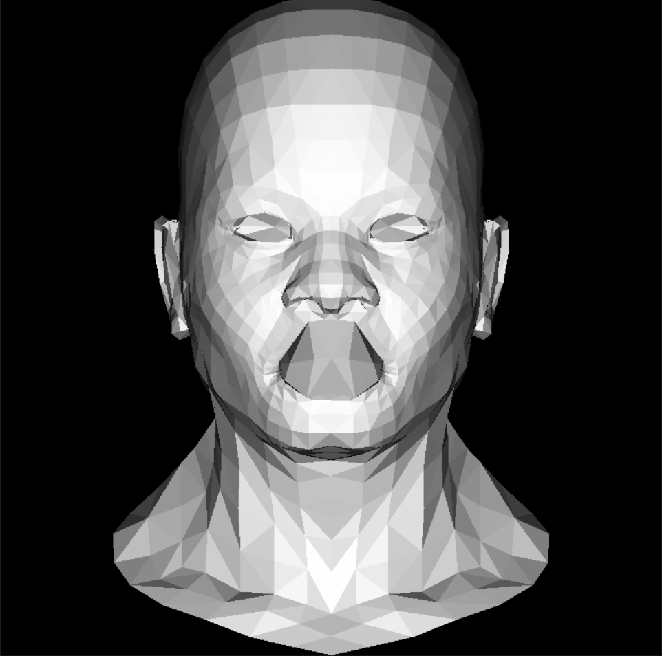

托更了很久终于更新了，主要是写到第三课的时候忍不住开始想怎么重构这节课写的画三角面的函数，然后思考函数怎么解耦，并且对于传入的三角面类型应该是浮点数还是整形的纠结了很久，无论是哪种都有足够的理由，浮点型精确，整型符合最后的像素的写入。最后选择了先写完再说，写出一坨屎山再说。
这节课主要写了如何把上次写的线框画成三角面。  

--- 
## 三角形的基础构想
不难想到，三角形可以用一行一行地填充满，但是如果从下到上的填充，那么就不可避免的会被分为两部分，由中间的点分为上下两部分，于是就有基础的三角绘图函数 `triangle` 
```c++
void triangle(const std::array<Vec3i, 3> &verts, const TGAImage &image, const TGAColor &color) {  
  auto point0 = verts.at(0);  
  auto point1 = verts.at(1);  
  auto point2 = verts.at(2);  
  //avoid a triangle degenerating into a line  
  if (std::abs(point0.y-point1.y)<=.1 && std::abs(point0.y - point2.y)<= .1) return;  
  //sort three point3 , now they sort by y in ascending order, we call them A , B , C  
  
  if (point0.y > point1.y) std::swap(point0, point1);  
  if (point1.y > point2.y) std::swap(point1, point2);  
  if (point0.y > point1.y) std::swap(point0, point1);  
  //calc the slope and draw triangle  
  
  
  for (int y = point0.y; y <= point2.y; ++y) {  
    auto pointA = point0 + (point2 - point0) * static_cast<float>(y - point0.y) / (point2.y - point0.y);  
    auto pointB = y >= point1.y ? point1 + (point2 - point1) * static_cast<float>(y - point1.y) / (point2.y - point1.y)  
                                      : point0 + (point1 - point0) * static_cast<float>(y - point0.y) / (point1.y - point0.y);  
    if (pointA.x > pointB.x) std::swap(pointA, pointB);  
    for (int x = pointA.x; x <= pointB.x; ++x) {  
      image.set(x, y, color);  
    }  
  }  
}
```

# 加速结构
## 包围盒
 
 然后我们使用包围盒加速，通过把遍历范围从整个屏幕缩小到包围着三角形的最小四边形，我们可以加速绘图。我已经把寻找包围盒抽象成为了一个单独的函数 `boundingBox` 。当然，未来可能会修改这个函数的参数。
 ```CPP
 struct BoundingBox {  
  int minX;
  int minY;  
  int maxX;  
  int maxY;  
};
 
 BoundingBox boundingBox(const std::array<Vec2i,3>& triangle,const TGAImage& image) {  
  Vec2i boundingBoxMin{image.get_width() - 1, image.get_height() - 1};  
  Vec2i boundingBoxMax{0, 0};  
  Vec2i clamp(image.get_width() - 1, image.get_height() - 1);  
  for (int i = 0; i < 3; i++) {  
    boundingBoxMin.x = std::max(0, std::min(boundingBoxMin.x, triangle[i].x));  
    boundingBoxMin.y = std::max(0, std::min(boundingBoxMin.y, triangle[i].y));  
  
    boundingBoxMax.x = std::min(clamp.x, std::max(boundingBoxMax.x, triangle[i].x));  
    boundingBoxMax.y = std::min(clamp.y, std::max(boundingBoxMax.y, triangle[i].y));  
  }  
  return {boundingBoxMin.x, boundingBoxMin.y, boundingBoxMax.x, boundingBoxMax.y};  
};
```

## 重心坐标

然后我们需要思考如何判断一个点在三角形内还是在三角形外，一般来说，有两种方法：第一种方法是使用向量相乘的方法，通过判断点与三个顶点形成的向量和边的叉积是否同号判断。还有一种方法是使用重心坐标法，判断是否符合重心坐标的结果。这里使用重心坐标法，向量相乘可以参考GAMES101作业的实现。
```CPP
Vec3f barycentric(const std::array<Vec2f, 3> &pts, const Vec2i &P) {  
  Vec3f u = cross(Vec3f{pts[2].x - pts[0].x, pts[1].x - pts[0].x, pts[0].x - P.x},  
                  Vec3f{pts[2].y - pts[0].y, pts[1].y - pts[0].y, pts[0].y - P.y});  
  if (std::abs(u.z) < 1) return Vec3f{-1, 1, 1};  
  return Vec3f{1.f - (u.x + u.y) / u.z, u.y / u.z, u.x / u.z};  
}
```
这是最终的 `triangle_bbox` 函数
```CPP
void triangle_bbox(const std::array<Vec3i,3>& triangle,const TGAImage &image, const TGAColor &color) {  
  BoundingBox bbox = boundingBox({{Vec2i{triangle[0].x, triangle[0].y},  
                                   Vec2i{triangle[1].x, triangle[1].y},  
                                   Vec2i{triangle[2].x, triangle[2].y}}}, image);  
  for (int x = bbox.minX; x <= bbox.maxX; x++) {  
    for (int y = bbox.minY; y <= bbox.maxY; y++) {  
      Vec2i P{x, y};  
      Vec3f bc_screen = barycentric({{Vec2f{triangle[0].x, triangle[0].y},  
                                      Vec2f{triangle[1].x, triangle[1].y},  
                                      Vec2f{triangle[2].x, triangle[2].y}}}, P);  
      if (bc_screen.x < 0 || bc_screen.y < 0 || bc_screen.z < 0) continue;  
      image.set(x, y, color);  
    }  
  }  
}
```
我们认为光强是表面法线和光线方向的乘积（兰伯特模型）
最终代码如下
```cpp
int main() {  
  
  const Model model("../../obj/african_head.obj");  
  const auto modelFace = model.getFaces();  
  const auto modelVerts = model.getVerts();  
  
  TGAImage gamma_head(800, 800, TGAImage::RGB);  
  Vec3f light_dir{0,0,-1.};  
  for (int i=0; i<model.getFaces().size(); ++i) {  
    auto face = modelFace[i];  
    const std::array face_triangle = {Vec3i{(int)((modelVerts[face[0][0]-1].x+1.)*gamma_head.get_width()/2.),  
                                            (int)((modelVerts[face[0][0]-1].y+1.)*gamma_head.get_height()/2.),  
                                            (int)((modelVerts[face[0][0]-1].z+1.)*gamma_head.get_height()/2.)},  
                                         Vec3i{(int)((modelVerts[face[1][0]-1].x+1.)*gamma_head.get_width()/2.),  
                                               (int)((modelVerts[face[1][0]-1].y+1.)*gamma_head.get_height()/2.),  
                                               (int)((modelVerts[face[1][0]-1].z+1.)*gamma_head.get_height()/2.)},  
                                         Vec3{(int)((modelVerts[face[2][0]-1].x+1.)*gamma_head.get_width()/2.),  
                                               (int)((modelVerts[face[2][0]-1].y+1.)*gamma_head.get_height()/2.),  
                                               (int)((modelVerts[face[2][0]-1].z+1.)*gamma_head.get_height()/2.)}};  
    Vec3f world_coords[3];  
    for (int j=0; j<3; ++j) {  
      world_coords[j] = modelVerts[face[j][0]-1];  
    }  
    Vec3f n = cross((world_coords[2]-world_coords[0]),(world_coords[1]-world_coords[0]));  
    n.normalize();  
    float intensity = dot(n,light_dir);  
    if (intensity>0) {  
      triangle_bbox(face_triangle, gamma_head, TGAColor(intensity*255, intensity*255, intensity*255, 255));  
    }  
  }  
  
  gamma_head.flip_vertically();  
  gamma_head.write_tga_file("lesson2_gamma_head.tga");  
  
  return 0;  
}
```
## 结果
如图所示



# ZBuffer

 现在我们来创建一个ZBuffer来消除这个不正确的嘴巴
 