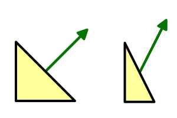

当进行model矩阵变换时，如果各个方向的分量变换（特指scale）不是统一的比例，会导致法线出现非预期的结果，如图。
将x变换为原来的 $1/2$ 时，法线会发生一次非预期的变化：法线的变换应该是x轴变化的倒数或者说逆。   



我们需要反转缩放，但是应该让旋转和投影矩阵保持不变，对于顶点的变换，应该有 $$ M = T_1T_2T_3 = S_1R_1P_1...$$
我们抛弃掉 $Position$ ，位置对于法线的变换没有任何影响，我们现在的矩阵可以简化为 $$M = S_1R_1S_2R_2 ...$$ 我们希望的矩阵长这样 $$O = S^{-1}_1R_1S^{-1}_2R_2$$ 思考一下：对于Model矩阵 $M$ 来说，我们有它的逆 $$M^{-1} = R^{-1}_2 S^{-1}_2 R^{-1}_1 S^{-1}_1$$ 注意到有：$$(M^{-1})^T = O$$ 所以将顶点法线转换到坐标空间的正确方法是
```shaderlab
i.normal = mul(transpose((float3x3)unity_WorldToObject), v.normal);
i.normal = normalize(i.normal);
```
当然，Unity官方提供了一个 `UnityObjectToWorldNormal` 函数进行这个操作，即有
```shaderlab
i.normal = UnityObjectToWorldNormal(v.normal);
```
查看定义
```shaderlab
// Transforms normal from object to world space  
inline float3 UnityObjectToWorldNormal( in float3 norm )  
{  
#ifdef UNITY_ASSUME_UNIFORM_SCALING  
    return UnityObjectToWorldDir(norm);  
#else  
    // mul(IT_M, norm) => mul(norm, I_M) => {dot(norm, I_M.col0), dot(norm, I_M.col1), dot(norm, I_M.col2)}  
    return normalize(mul(norm, (float3x3)unity_WorldToObject));  
#endif  
}
```
不难发现转换了乘法的顺序减少了一次转置操作，有利于编译器更好的实现代码。