**本文为Graphics组授课留档记录**   

	“Unweave a ranibow ,as it erewhile made. The tender-person'd Lamia melt into shade.” ——John Keats
	“如刚才拆解彩虹那般，让光线娇嫩的Lamia黯然失色。” ——约翰 · 济慈  

> 参考资料  
 RTR4-CN第八章   
 [The Amazing Math behind Colors!](https://www.youtube.com/watch?v=gnUYoQ1pwes)    
   [ 客观与认知——色度学与颜色感知【中科院科学公开课S03E09】](https://www.bilibili.com/video/av308811244?t=1619)

任何基于物理的渲染方法,其第一步都是以一种精确的方式,来对光进行量化(quantify)。在本小节中,我们首先会介绍辐射度量学(radiometry),因为它与光线的物理传输过程紧密相关。
然后我们紧接着会讨论光度学(photometry),它会根据人眼的灵敏度,对光线值进行加权。  
# 光
在物理光学(physical optic)中,光被认为是一种电磁横波(electromagnetic transverse wave),它使得电场(electric field)和磁场(magnetic field)在其传播方向的垂直面上来回振荡。电场和磁场的振荡是耦合的,二者的矢量相互垂直,并且长度之比也是固定的.

光以电磁波的形式存在，光和电子的相互作用十分密切：原子的能级跃迁会吸收/释放 光子。在自然界中，电磁波的波长范围相当广，有波长不到百分之一纳米的伽马波，也有波长长达数万公里的极低频无线电波。可见光是整个电磁波谱的一小部分，是波长为380nm ~ 760 nm的电磁波。牛顿著名的三棱镜分光实验将白光分解为七个颜色（据说是因为牛顿对于音乐的喜爱所以按七个音阶对应成了七个颜色。）

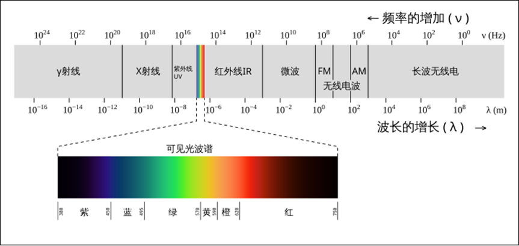

# 辐射度量学（Radiometry）
各个辐射量（radiometric quantity）的存在是为了对电磁辐射的各个方面进行测量和度量，例如：总能量、功率（随时间变化的能量）以及相对于面积、方向或者二者的功率密度等。
## Radiant flux（辐射通量）
在辐射度量学中，最基本的单位是辐射通量（radiant flux) $\phi$ ，辐射通量是指辐射能量随时间的流动变化，又叫做功率（power），其单位为瓦特(watts，W)。
## Irradiance（辐照度）
辐照度（irradiance）是辐射通量相对于面积的密度，即 ( $d\phi/dA$ )。irradiance 是相对于一个面积来进行定义的，这个面积可能是空间中的一个假想区域，但是在渲染中一般都是物体的表面。irradiance 的单位是瓦特每平方米（$W/m^2$ ）。
## Radiant Intensity（辐射强度）
### 立体角（Solid Angle）

在二维空间中，我们将角度定义为弧的长度与半径的比值，只需要 $2\pi$ 就可以表示整个单位圆的角度，在三维空间中，我们使用单位球来定义立体角，即立体角形成的一组方向与单位球所相交的面片的面积。立体弧度为 $4\pi$ 的立体角可以覆盖整个单位球。
现在我们可以引入辐射强度(radiant intensity) $I$，即辐射通量相对于方向的密度，更准确地说，是相对于立体角的密度( $d\Phi/d\omega$ )。它的单位是瓦特每立体弧度（$W/sr$）。
## Radiance(辐射度)
最后，辐射度（radiance） L是对单条光线中电磁辐射的度量。更精确地说，它是辐射通量相对于面积和立体角的密度（ $d^2\Phi/dAd\omega$ ）。这里的面积位于垂直于光线的平面上，如果想要在其他方向上对表面施加辐射，则必须使用余弦因子进行校正。我们可能还会遇到一些其他对于 radiance 的定义，它们使用了术语“投影面积”来代表这个校正因子。  
radiance 是传感器（例如眼睛或者相机）所直接测量的对象，因此它对渲染而言至关重要。计算着色方程的目的就是沿着给定的光线，计算从着色点到相机的radiance；沿着这条光线计算出来的结果 L，与第 5 章中的$c_{shaded}$ 在物理上是等价的。radiance的公制单位是瓦特每平方米每立体弧度（ $W/m^2sr$ ）。
环境中的 radiance 可以被认为是五个变量（或者六个变量，将波长考虑在内）的函数，它被称为辐射分布（radiance distribution）；其中有三个变量指定了位置，另外两个变量指定了方向，这个分布函数描述了在空间中任何地方传播的任何光线。根据上面的描述，我们可以这样来理解渲染过程：将眼睛和屏幕定义为一个点和一组方向（例如从眼睛出发，穿过每个像素的光线），然后使用这个函数，在这组方向上对眼睛所在的位置进行评估。
# 光度学（Photometry）
辐射度量学仅仅对物理量进行了研究，它完全没有考虑人眼的感知。与此相关的一个领域被称为光度学（photometry），它与辐射度量学类似，不同之处在于，它会根据人眼的敏感度，对辐射度量学中的一切事物进行加权处理。通过乘以 CIE 光度曲线（CIE photometric curve），辐射度量学中的计算结果可以被转换为相应的光度单位。CIE 光度曲线是一条以 555 纳米为中心的钟形曲线，它代表了人眼对各种波长光线的响应程度。

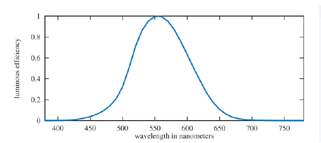

这个转换曲线与测量单位，是光度学理论和辐射度量学理论之间的唯一区别。每个辐射物理量都有一个对应的光度学物理量，下表给出了它们的名称和单位。这些光度学物理量的单位都有预期的对应关系（例如：lux 的单位是 lumen 每平方米）。虽然逻辑上来讲，lumen（流明）应该是个基本单位，但是在历史上，candela（坎德拉）则被定义为基本单位，而其他单位都是从坎德拉中派生出来的。在北美，照明设计师仍然会使用已被废弃的英制测量单位，而不是使用 lux（勒克斯），这个英制单位叫做英尺烛光（foot-candle，fc）。无论哪种情况，大多数测光仪都会对illuminance 进行测量，这个单位在照明工程（illumination engineering）中十分重要。

| Radiometry Quantity | Units      | Photometric Quantity | Units        |
| ------------------- | ---------- | -------------------- | ------------ |
| Radiant flux        | watt (W)   | Luminous flux        | lumen (lm)   |
| Irradiance          | W/m^2      | Illuminance          | lux (lx)     |
| Radiant intensity   | W/sr       | Luminous intensity   | candela (cd) |
| Radiance            | W/(m^2·sr) | Luminance            | cd/m^2 (nit) |

Luminance 通常用来描述平面的亮度。例如：高动态范围（high dynamic range，HDR）电视屏幕的峰值亮度通常在 500 到 1000 尼特（nit）之间。相比之下，晴朗天空的亮度大约为 8000 尼特，60 瓦的电灯泡约为 12 万尼特，地平线上的太阳约为60 万尼特。
# 色度学（Colorimetry）
真正关键的特性是波长，眼睛捕捉到波长通过向大脑发送信号，我们将其感知为颜色。因此色彩并非光的固有属性，而是一种心理现象，它与波长有关，本质上是间接的。所以色彩并不仅仅是不同波长的直接对应，因为还有眼镜将光转换成大脑可识别信号。
## 眼睛的结构
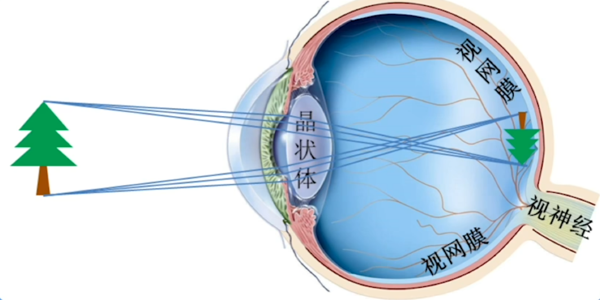

外界物体经过折射后，成像到视网膜上。

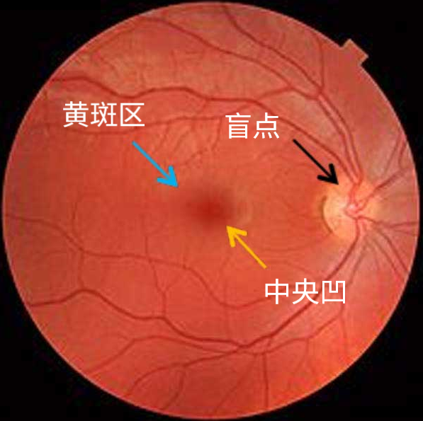

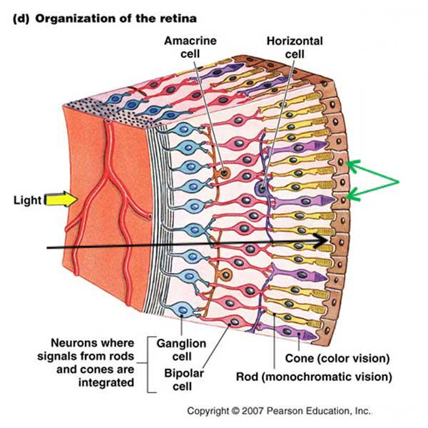 

人类的眼睛血管与神经在感光细胞之前，这是进化史上的遗留问题，为了减弱这种影响，中央的部分血管和神经更薄以减弱影响，就有了中央凹这种结构。盲点则是血管神经穿透眼球连接到大脑，导致该区域没有视觉细胞。
黄斑区聚集了大量的视觉细胞，主要分为两种，分别是视锥细胞（Cones cells）和视杆细胞（Rod cells）。视锥细胞主要负责对颜色的感知，视杆细胞主要负责对亮度的感知。视锥细胞大约数量为600w，每种负责检测对应的波长。
视锥细胞一共有三种，分别对短波长(400 ~ 550nm,响应曲线峰值在440nm），中等波长（400nm ~ 650nm，响应峰值在540nm），长波长（430nm ~ 700nm，响应峰值在570nm）敏感。
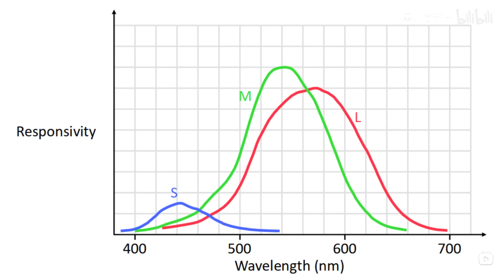

把三个视锥细胞的响应曲线绘画出来，大约长这个样子，值得注意的是短波长的绝对响应曲线峰值强度远远低于其他两条响应曲线的峰值强度。因此常会把这些曲线归一化。

人眼会把短波长，中等波长，长波长的光线识别为蓝色，绿色，红色。这有一些道理，但不准确，长波响应视锥细胞被完全激活时（570nm）时，其实仍然处于绿色范围内。所以根据波长划分才更准确。
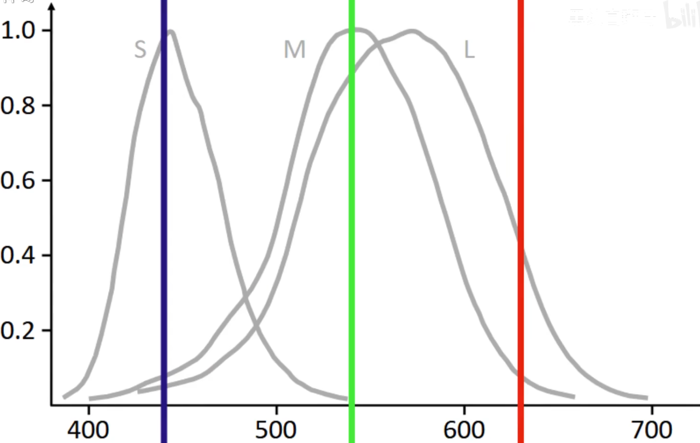

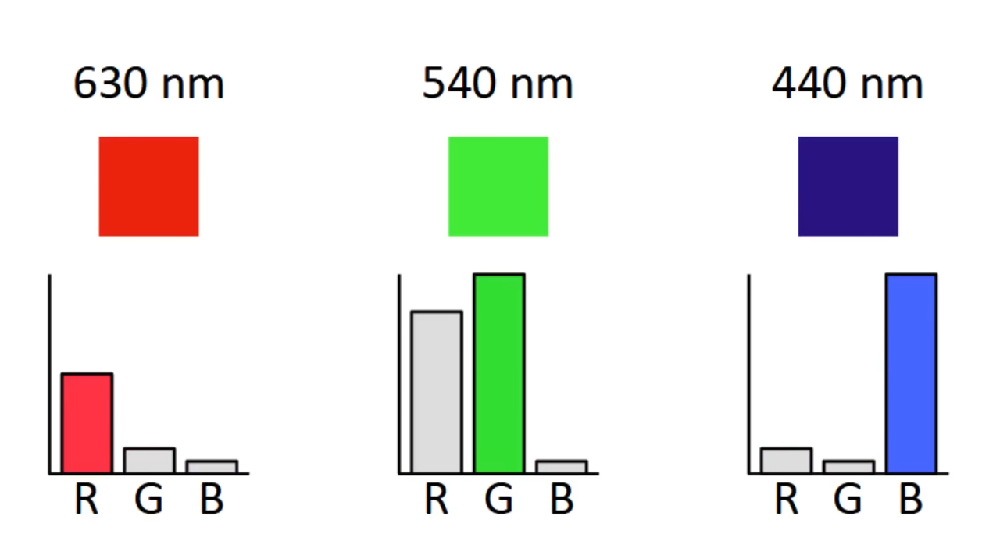

# 色彩空间

由于人类只有三种颜色感受器，所以只用三个数字就可以精确的表示任何颜色。但是如何确定颜色之间的对应关系呢？CIE（Commission Internationale d'Eclairag）提出了一套标准，并根据标准进行了配色实验。
当时使用汞灯，汞的原子光谱中的700nm,546nm,436nm可以做的比较纯，然后将三个颜色叠加，再另一侧使用分光计或这光栅等设备得到连续的颜色。通过调节三种颜色的权重获得相同的颜色。就得到了颜色匹配函数（color-matching function)。
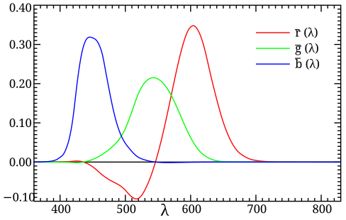  
有一段曲线的值是负的，这意味我们无法通过混合三色光得到这种颜色，而是需要把对应的光源添加到待测颜色的色块中才能使人眼的感知相同。

如果把所有波长对应的光显示出来，我们不难发现一些问题：许多颜色有缺失，比如粉色，品红，棕色，米黄？最重要的是：白色和黑色？
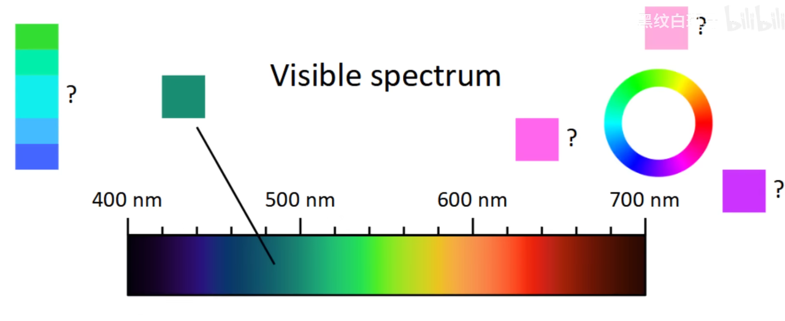

黑色是无光环境下的颜色，除此之外，亮度也是一个需要考虑的问题：眼睛的视锥细胞数量大约有600w，在低亮度的情况下，不可能所有的视锥细胞都能被激活。只有部分视锥细胞被激活的情况下，大脑会把黑色和原色进行混合，形成变体。

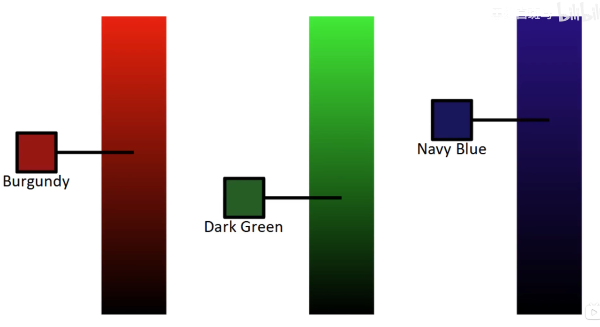

而对于橙色，黄色这种鲜亮的颜色，当变暗后与原来的颜色差别过于明显，我们把它们视为新颜色，
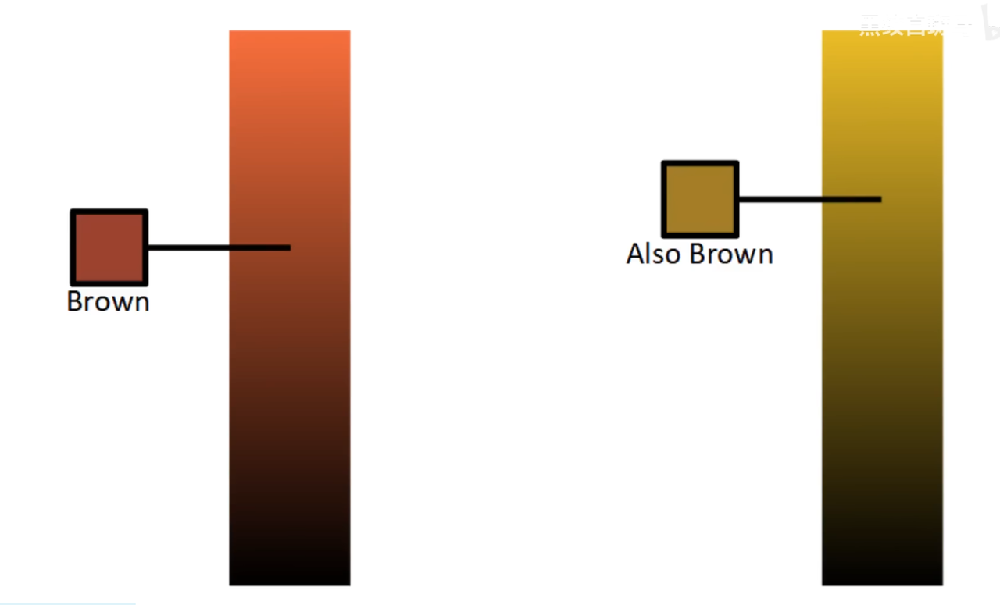

使用亮度和波长，即可表现出一个二维的色彩空间。
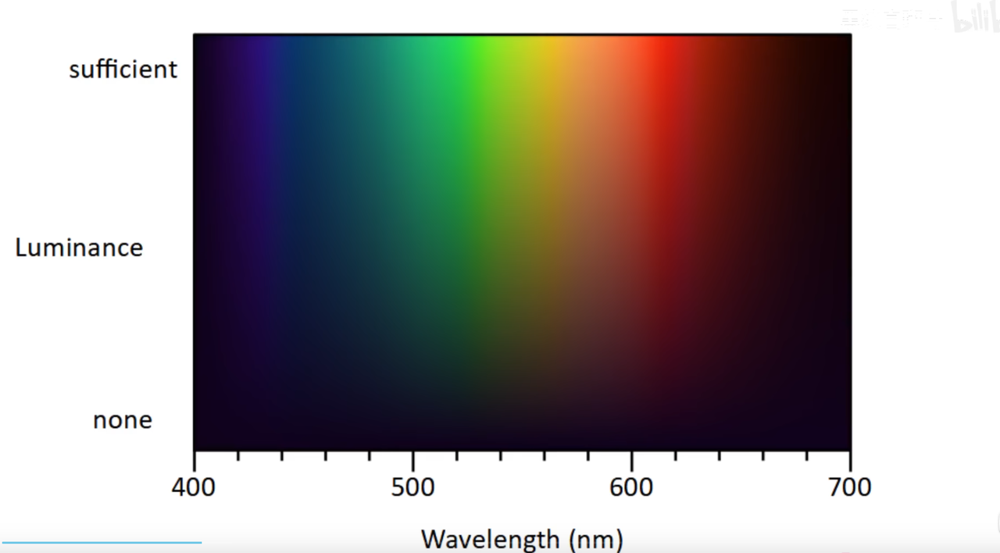

现在有一些之前遗漏的颜色可以找到了，但是仍然有很多颜色没有找到：比如品红，粉色。为了解决这个问题，我们需要引入色彩空间的概念，我们把短波长，中波长，长波长作为坐标系的三个轴，然后我们就可以在空间中得到这样一条曲线：

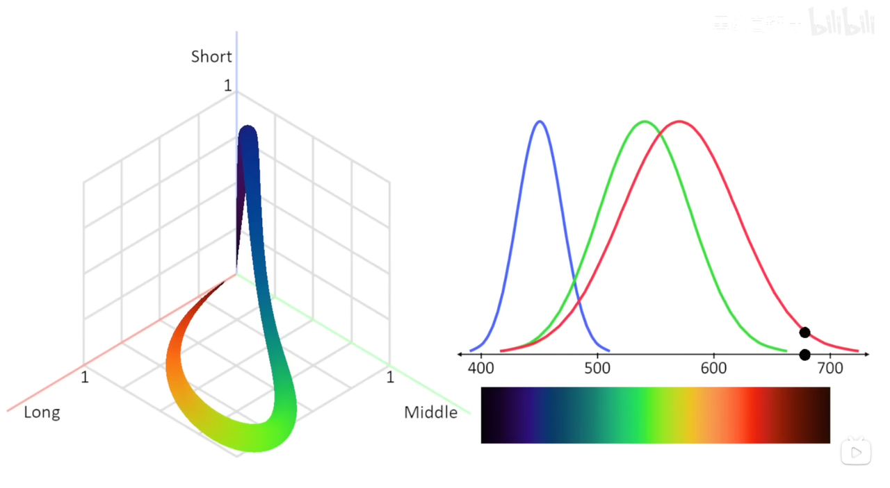

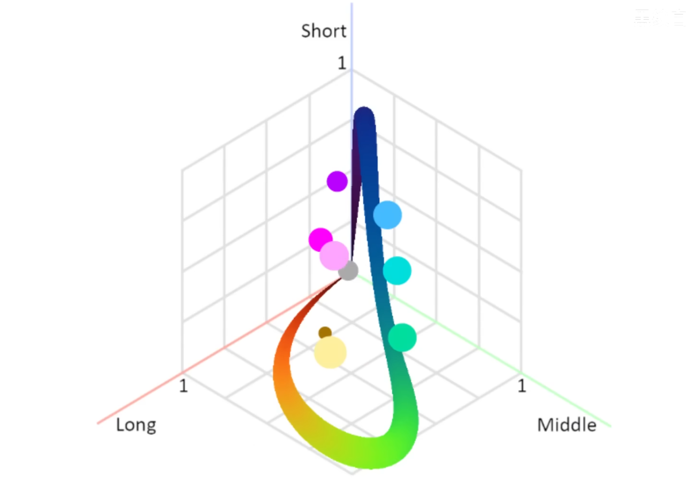

通过对不同的光线进行混合，就可以在现实中得到这些颜色。

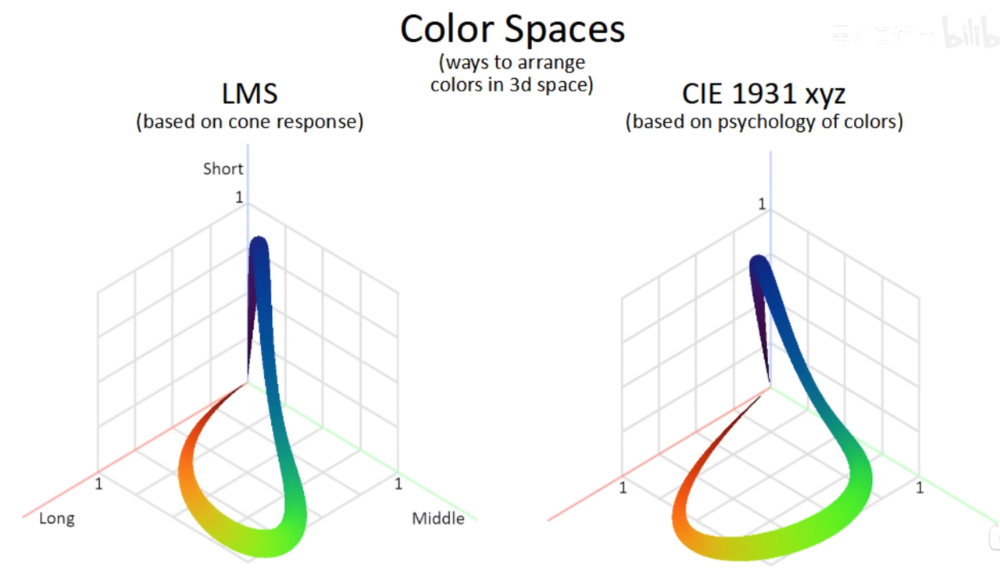

刚才讲的色彩空间叫做LMS空间，它对于响应曲线是归一化的，如果我们把真正响应曲线进行加权，那么便会得到CIE色彩空间。

好的，但是这个空间是三维的，如果我想总览所有颜色，就会不太方便。回想之前的内容，降低颜色的亮度会逐渐变成黑色，但是颜色本身的色调是没有改变的，我们把同一色调但是不同亮度的颜色可以在这个空间坐标中连成一条线，这条线被称为色度线，色度线与平面 $x+y+z=1$ 的交点，就可以认为是这个点在平面上的位置。

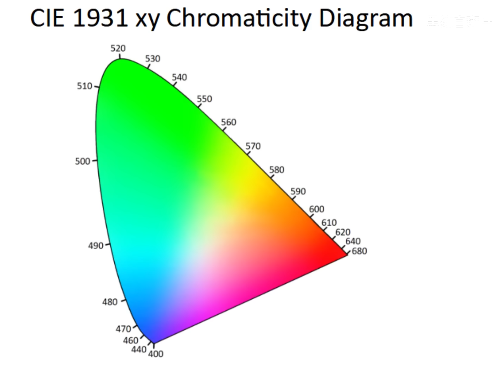
