> [! ]

> "All it takes is for the rendered image to look right." ——Jim Blinn

  

==本节课参考RTR4-CN 第六章==

  

表面纹理(texture)是指其外观和给人的视觉感受,就像是一幅油画的图案一样。

  

而在计算机图形学中,纹理化则指的是一个过程,即通过使用一些图像、函数或者其他数据,来对每个表面位置的外观表现进行修改。例如:我们可以将一张砖墙的彩色图像应用于由两个三角形组成的矩形上,而不是去精确表现砖墙的几何结构。当我们观察这个砖墙矩形的时候,对应的彩色图像将会显示在这个矩形所在的位置上,这样可以使得这个矩形看起来很像真实的砖墙。除非相机十分靠近墙壁的话,否则砖墙几何细节的缺乏并不会带来明显的视觉瑕疵。

  

# 纹理管线

  

纹理化（texturing）是一种用于描述表面材质以及对表面进行修饰加工的有效技术。纹理的工作原理是通过修改着色方程的中的参数，对最终结果产生影响。比如说，对于刚才的那个例子，通过替换点的位置，将顶点颜色为纹理颜色。或者粗糙度纹理修改了表面的粗糙度值，凹凸纹理修改了表面着色法线的方向。

  

为了与屏幕上的像素（pixel）有所区别，纹理上的像素通常被称为纹素（texel）。

  

纹理化的起点是一个空间中的具体位置，这个位置可以在世界空间中，但是通常是基于模型空间参考系的，因为纹理会随着模型移动而移动。这个空间点会使用一个投影函数（projection function）获得一组数字，它被称为纹理坐标，纹理坐标可以用于访问采样纹理，这个过程称为纹理映射。

  

在使用纹理坐标访问纹理之前，还需要使用一个或多个转换函数（corresponder funcion)，来将纹理坐标转换到纹理空间中，用来在纹理中获取像素值。例如：纹理空间位置是图像纹理的数组索引，从而检索到对应的位置的值。检索到的像素值可能还要使用一个值转换函数（value transform function)进行转换，最终这些新值会用于对表面的某些属性进行修改。值得注意的是，并不是每次纹理应用都需要激活管线中的所有步骤。

  

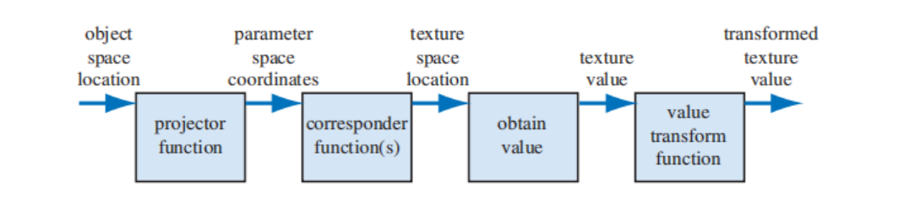

  

例如:对于一个具有砖墙纹理的三角形,我们在其表面上进行采样时会发生如下情况(112如图 6.3 所示):首先我们会在该物体的局部参考系中,找到对应的采样位置(x, y, z),这里假设它是 (−2.3, 7.1, 88.2)。然后会对这个位置坐标应用一个投影函数,就像世界地图是三维地球的二维投影那样,这里的投影函数通常会将一个三维向量 (x, y, z)转换为一个二维向量 (u, v)。本例中所使用的投影函数,实际上与正交投影是等价的(章节 2.3.1),它就像幻灯片放映机一样,将砖墙图像投影到三角形表面上;并且为了最后能将图象值返回到墙面上,其表面上的点都会被转换为一个0-1 范围内的数值对,这里我们假设转换后的值是 (0.32, 0.29),这个数值对也被称为纹理坐标或者 UV 坐标。这个纹理坐标将用于查找纹理贴图在此位置上的颜色值。假设这里我们所使用的砖墙纹理分辨率为 256 × 256,因此使用转换函数,将纹理坐标 (u, v)各自乘以 256,即 (81.92, 74.24)。在丢弃小数部分之后,我们在砖墙图像中进行检索,找到索引值为 (81, 74)的颜色值,这里假设这个颜色值为(0.9, 0.8, 0.7)。同时,我们所使用的纹理颜色位于 sRGB 颜色空间中,因此如果要在着色方程中使用这个颜色值,还需要将其转换到线性空间中,即(0.787、0.604、0.448)。

  

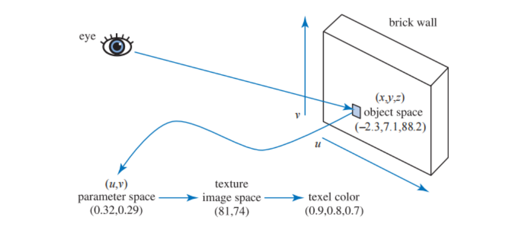

  

## 投影函数（Projection function）

  

纹理处理的第一步是获取表面的位置，并将其投影到纹理坐标空间（texture coordinate space）中，这个纹理坐标空间中通常是二维（u,v)的，常见的建模软件允许艺术家定义每个顶点的uv坐标，这些坐标可以从投影函数或者网格展开算法中进行初始化，艺术家也可以编辑uv坐标。

  

投影函数的作用通常是将空间中的三维坐标转换为二维纹理坐标，在建模软件中常见的投影包括球面投影，柱面投影，平面投影等。还有一些投影函数根本不是投影操作，而是隐含在表面创建和曲面细分中。例如，参数化生成的曲面定义本身就包含了一组天生的uv坐标。投影函数的最终目标只是生成纹理坐标，将其作为一个与位置有关的函数来进行推导只是一种方法。有时候单个投影函数就可以用于整个模型的投影操作，但是艺术家通常一些工具将模型进行细分，并单独应用不同的投影函数。

  

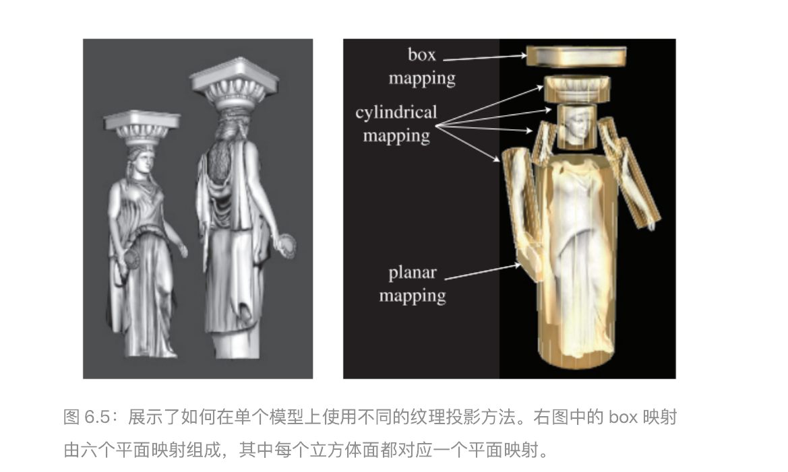

  

在实时渲染领域，通常在建模时就会使用投影函数，将结果存储在顶点上。但是并不是总是如此，有时在顶点着色器或者像素着色器中应用投影函数会带来一些好处，比如提高精度，有助于实现动画在内的各种效果。有时候一些渲染方法有着独特的投影函数，会进行逐像素的计算，比如环境映射。与投影方向相近的表面会产生严重的扭曲，所以艺术家经常需要手动将模型分解为小块（即建模过程中的展uv）。

  

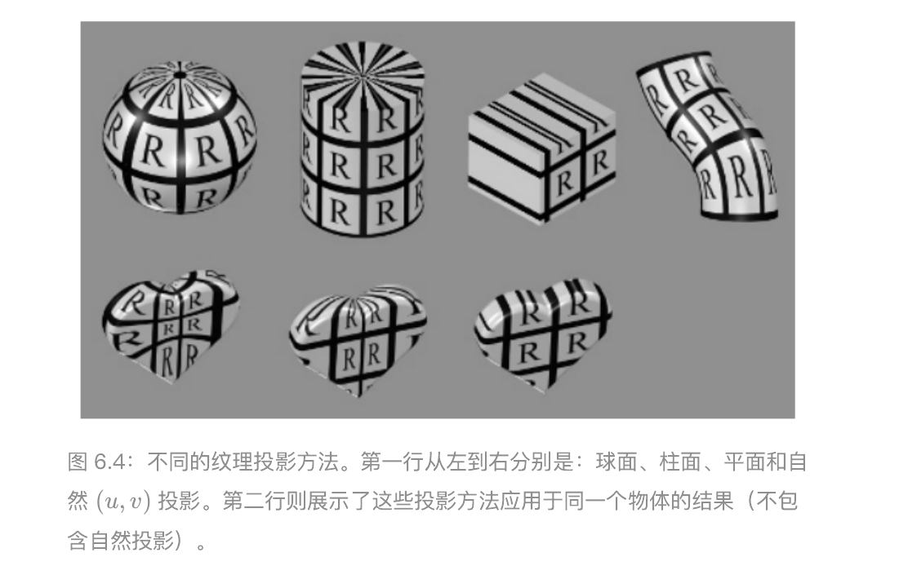

  

纹理坐标空间并不总是一个二维平面，有时候也可以是一个三维体积，这时纹理坐标有三个分量（u，v，w）。部分情况甚至会用四个坐标（即齐次坐标描述）（s，t，r，q）。

  

还有一种重要的纹理坐标空间是方向性的，纹理空间的每个点都通过输入方向来访问。每个点位置上的法线代表了访问该纹理的输入方向。使用这种方向性的纹理最常见的纹理类型就是立方体贴图（cube map）。

  

值得注意的是，一维的纹理也有各自的用途。例如：对于一个地形模型而言，颜色可以由高度决定。或者作为一个一维查找表。

  

## 转换函数（Corresponder function）

  

转换函数用于将纹理坐标转换为纹理空间的具体位置，它们提高了在表面上应用纹理的灵活性。其中一个例子是：使用API选择现有纹理的一部分来显示，并且在后续的操作都只会使用这个子图像。

  

另一类转换函数则是矩阵变换，应用于顶点着色器或片元着色器中，他们允许对表面上的纹理进行平移、旋转、缩放、剪切或者投影操作。

  

另一类转换控制图像的应用方式。纹理坐标uv只有在（0，1）这个范围才是有意义的的。但是如果纹理坐标位于范围之外时，它应该如何取值呢？转换函数决定了会发生什么。在OpenGL中，这种类型的转换函数被称为包装模式（wrapping mode），在DirectX中被称为纹理寻址模式（texture addressing mode）。常见的转换函数包括如下类型：

  

- wrap（directX），repeat（OpenGL）或者tile：图像表面会不断重复。

- mirror：图像会不断重复，但是每重复一次就会被镜像翻转一次。

- clamp（directX）或者clamp to edge（opengl）：位于（0，1）范围之外的纹理坐标会被限制在这个范围内。这种模式会导致图像边缘的不断重复，优点在于在纹理附近发生双线性插值时，可以避免从纹理的相反边缘进行采样。

- border（directX）或者clamp to border（OpenGL）：位于（0，1）范围之外的纹理坐标会被映射成同一个值。

  
  
  

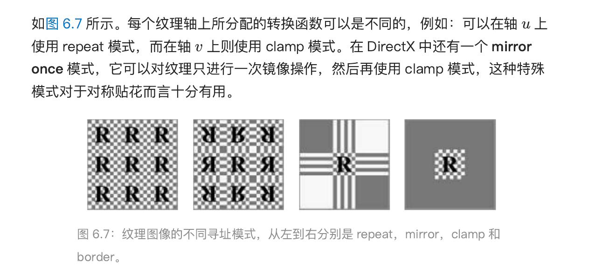

  

纹理的重复平铺是一种为场景添加更多视觉细节的廉价方法。但是人眼能识别出这种不自然的重复。一个常见的解决方法与另一个非重复平铺的的纹理结合。另一个方法是，使用着色器实现一些特殊的转换函数，从而将纹理图案和瓦片贴图进行随机重组。

  

最后一种被应用的转换函数是隐式的，并且与图像的大小有关。纹理通常会应用在uv坐标的（0，1）范围内。例如砖墙的例子，通过将该范围内的纹理坐标乘以分辨率得到对应的像素位置。这种将纹理坐标限制在（0，1）范围内的优势是不需要对不同分辨率的纹理在顶点内存储不同的纹理坐标值。

  

## 纹理值

  

生成纹理坐标空间后，便可以用这个坐标获取对应的纹理值。对于图像纹理中，这是通过检索图像中的纹素得到的。实时渲染的绝大多数函数都是图像纹理。但也有程序生成的纹理，这种情况下便不涉及内存查找，而是变成了一个函数值的计算。

  

最常见最直接的纹理值便是RGB三元组，它可以用于替换或者修改表面的颜色。另一种类型是RGBA，A（alpha）通道代表了纹理的不透明度。纹理贴图中不仅仅可以存储颜色数据，也可以存储其他类型的数据，比如表面粗糙度等。

  

纹理中返回的值可以在使用前进行转换。一个常见的例子是把（0.0,1.0）这个无符号范围映射回（-1.0,1.0）这个范围，用这个方法可以在纹理内存储法线数据。

  

  

# 图像纹理

  

像素着色器可以通过纹理坐标传给texture2D等函数，并调用他们来访问纹理，在不同的图形API有两个主要区别。

  

1. 在DirectX中，纹理的左上角对应的（0，0），右下角对应（1，1）。而在OpenGL中左下角的位置对应了（0，0）。这正好是DirectX翻转y轴得到的结果。

2. 纹素具有整数类型的坐标，但是我们经常会有访问两个纹素中间的值，并在它们之间进行插值，这就引出了一个问题：像素中心的浮点坐标是什么？但是我们会经常想要访问两个纹素之间的位置,并在它们之间进行插值,这就引出了一个问题：像素中心的浮点坐标是什么？Heckbert讨论了两种可能的模式:截断(truncate)和舍入(round)。DirectX 9 将每个纹素的中心定义在(0.0, 0.0)处,它采用了舍入方法。但是这个系统稍微有点混乱,因为对于 DirectX左上角像素(原点)而言,该像素的左上角坐标为 (−0.5, −0.5) 。DirectX 10 学习了 OpenGL 的纹理坐标系统,让每个纹素的中心值为 (0.5, 0.5),即使用了截断方法,或者更准确地说是向下取整(floor),即小数部分会被丢弃。向下取整是一个更加直观的系统,它可以很好的用语言进行表述,例如:当我们说一个像素位于坐标(5, 9)时,实际上我们指的是沿 u轴方向上从 5.0-6.0 的范围,以及沿 v 轴方向上从 9.0-10.0 的范围。

  

**依赖纹理读取**(dependent texture read)是一个值得解释的术语,它包含两个定义。

  

第一个定义是对于移动设备而言的，当我们使用texture2D或者类似方式访问纹理并在片元着色器内手动计算纹理坐标，而不是使用顶点着色器传入的、未修改的纹理坐标时，就会发生依赖纹理读取。手动计算纹理甚至包括交换uv这种简单操作！对于老旧的不支持OpengGL ES 3.0的移动设备GPU来说，不发生依赖纹理读取会有更高的效率。因为可以预读取

  

另一个定义则是一个纹理坐标依赖之前的纹理值。比如法线贴图改变了表面法线，而cube map访问又依赖于法线。

  

**纹理尺寸** 通常为 $2^m \times 2^n$，这样的纹理被称为2次幂（power of two ,POT)纹理，现代GPU可以处理任意大小的非2次幂（non power of two ，NPOT)纹理。但是老旧设备可能不支持NOPT的mipmap。不同的图形API对于纹理尺寸有着不同的上限。 DirectX12 允许一张16384 *16384分辨力的纹理。

  

设想一下，纹理被放大和缩小后，这时我们又会看到什么样的图像？这个问题的答案取决于我们使用什么样的采样和过滤方法。

  

## 放大（magnification）

  

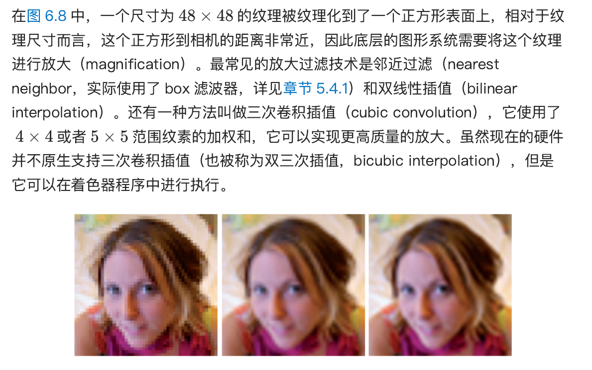

  

在图 6.8 的最左侧,我们使用了邻近过滤的方法。这种放大技术的一个特点是,单个纹素可能会变得十分明显。这种效果被称为像素化(pixelation);因为该方法在放大的时候,会选取距离每个像素中心最近的纹素,从而产生了块状外观。虽然这种方法的质量有时会很差,但是它的好处在于,只需要为每个像素获取一个纹素即可。

  

在图 6.8 的中间,我们使用了双线性插值(有时也会叫做线性插值)方法。对于每个像素而言,这种过滤方法需要找到四个相邻的纹素,并在二维上进行线性插值,从而获得混合后的像素值。虽然双线性插值的结果是比较模糊的,但是它并不会像邻近过滤那样出现锯齿。你可以做一个简单的小实验,尝试眯着眼睛来看左边的图像,你就会发现图像的锯齿也消失了,因为这样做(眯着眼睛观察)的效果其实和低通滤波器是大致相同的,并且更能展示面部的特征。

  

在图 6.8 的右侧,我们使用了双三次插值(bicubic filter),它大幅去除了剩余的方块感。需要注意的是,双三次插值比双线性插值的计算成本更高,但是许多的高阶滤波器都可以被表示为重复的线性插值,因此可以通过若干次简单的线性插值,来充分利用纹理单元中用于线性插值操作的 GPU 硬件。

  

### 双线性插值

  

这里我们回到本章一开始提到的砖块纹理例子:在不舍弃小数的情况下,我们会获得坐标 (pu , pv ) = (81.92, 74.24)。这里我们使用与 OpenGL 同样的纹理坐标系,其原点位于左下角,它与标准的笛卡尔坐标系是相匹配的。我们的目标是在四个最近的纹素中心之间,建立一个局部坐标系,并在这四个纹素中心之间进行插值,最终获得该点的像素值,如图 6.9 所示。为了找到 4 个最近的相邻像素,我们从采样位置减去像素中心的分数部分 (0.5, 0.5),得到 (81.42, 73.74)。在去掉中心的小数部分之后,距离最近的 4 个像素范围即为 (x, y) = (81, 73)到 (x + 1, y + 1) = (82, 74)。在这个例子中,分数部分 (0.42, 0.74)是该采样点在这个局部坐标系(由相邻的四个纹素中心构成)中的位置,我们将这个位置表示为 (u′ , v′ )。

  

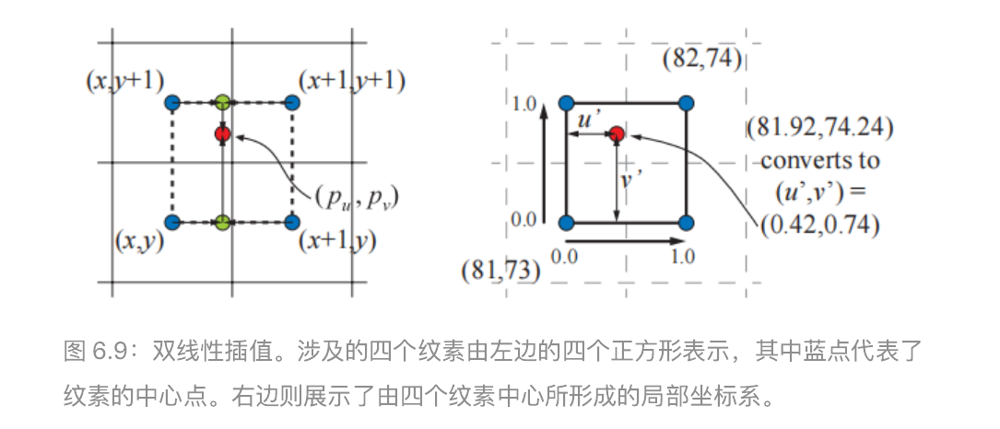

  

这里我们将纹理访问函数定义为 t(x, y),该函数会返回对应纹素的颜色,其中 x和y 是整数。那么任意位置 (u′ , v ′ )的双线性插值颜色可以按照以下两步进行计算:首先,使用下方的两个纹素颜色 t(x, y)和 t(x + 1, y),按照参数 u′ 进行插值,即 $$(1−u')\ast t(x,y)+u'\ast t(x+1,y) $$;再使用上方的两个纹素颜色 t(x, y + 1)和t(x + 1, y + 1),按照参数 u′ 进行插值,即 $$(1−u')\ast t(x,y+1)+u' \ast t(x+1,y+1)$$ ,如图 6.9 左侧的绿色圆圈。然后对这两个值在竖直方向上,按照参数 v′进行插值,即将上述过程结合起来,最终 (pu , pv )处的双线性插值颜色 b为:

  

$$b(p_u,p_v) = (1-v')((1−u') t(x,y)+u' t(x+1,y)) + v'((1−u') t(x,y+1)+u' t(x+1,y+1)) $$$$= (1-u')(1-v')t(x,y) + u'(1-v')t(x+1,y）+（1-u')v't(x,y+1)+u'v't(x+1,y+1)$$

  

从直观上说，距离采样位置越近的纹素，对于颜色的影响就越大，注意到：右上角纹素的影响力和左下角的矩形面积相同。

  

### 双三次插值

  

在刚才那张图的右侧，我们使用了双三次插值（bicubic filter)，需要注意的是，双三次插值比双线性插值的计算成本更高。还有一种更简单的技术，使用一个简单的平滑曲线进行插值。最常见的是smoothstop和quintic曲线

  

- smoothstep： $$x^2(3-2x) $$

- Quintic： $$x^3(6x^2-15x+10)$$

  

smoothstep函数具有 $$s'(0) = s'(1)=0$$的性质（ $C^1$ 连续），quintic曲线具有类似的性质，唯一不同的是 $$q''(0)=q''(1)=0$$ ( $C^2$连续）。

  

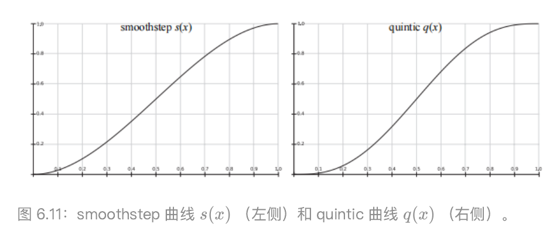

  

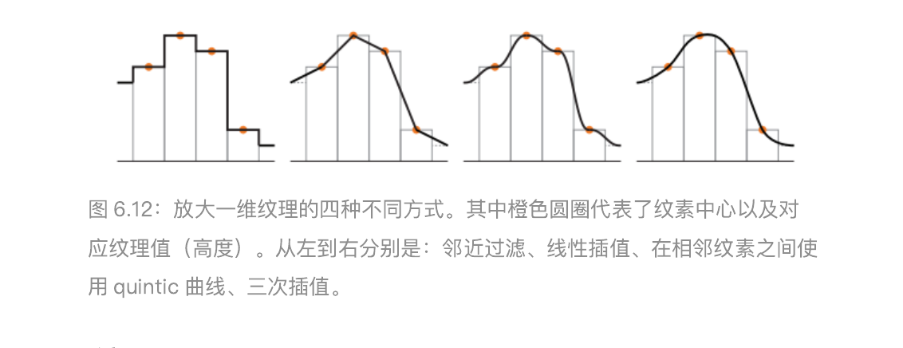

  

## 缩小（minificatioin）

  

当纹理被压缩时,平面上的一个像素单元格可能会占据好几个纹素。为了正确获得这个像素的颜色值,我们应当将这几个纹素对像素的影响整合起来。然而,精确确定某个像素附近所有纹素对其的影响是很难的,而且想要以实时的速度来完美地实现这一点几乎是不可能的。

  

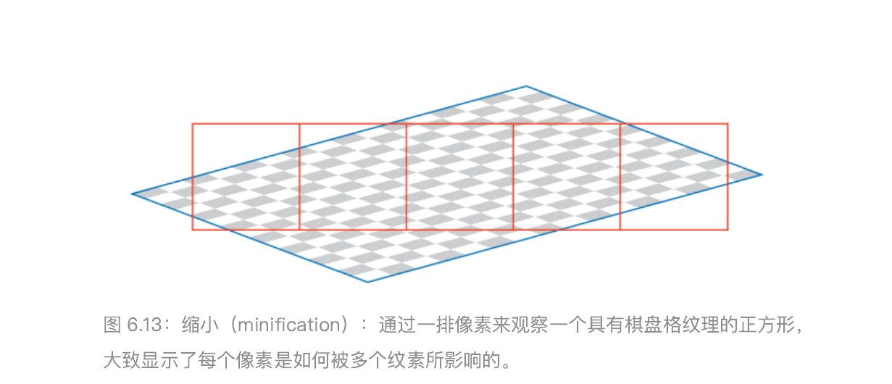

  

最简单的方法是使用邻近过滤（nearest neighbor）这个方法会产生严重的锯齿问题.

  

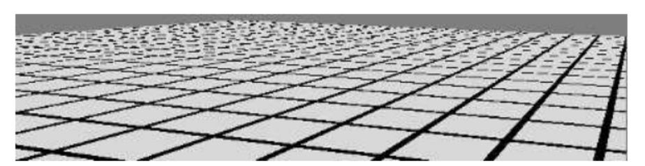

  

当表面相对于相机发生移动时，这种瑕疵会变得更加明显，这种在运动中所产生的瑕疵被称为时域锯齿（temporal aliasing）。另一个常用的手法是双线性插值，但是当一个像素受到超过四个像素的影响时，双线性插值就会失效并开始产生锯齿。

  

走样根据之前的讨论，走样问题可以通过采样技术和滤波技术来解决。为了实现这个目标，我们要么提高像素的采样频率要么降低纹理的信号频率。但是采样频率的提高总是有限的，我们需要一些技术来降低纹理的频率。

  

### Mipmap

mipmap是最流行的纹理抗锯齿方法，现如今所有的图形加速器都支持这种方法。
mip是拉丁语multum in parvo 的缩写，意思是一个很小的地方有很多东西。这揭示了mipmap的工作原理：将原始图像反复过滤为更小的图像。
在使用 mipmap 滤波器的时候,在实际渲染发生之前,原始纹理图像会生成一系列较小尺寸的版本。原始纹理(第 0 级)会被下采样到原始尺寸的四分之一,每个新生成的纹素值,通常为原始纹理中四个相邻纹素的平均值,这个新生成的纹理(第 1 级)有时也会被叫做原始纹理的子纹理(subtexture)。这个下采样的过程会被递归执行,直到最终生成的某个纹理的维度为 1。这组图片的集合通常被称为一个 mipmap 链(mipmap chain)。
  

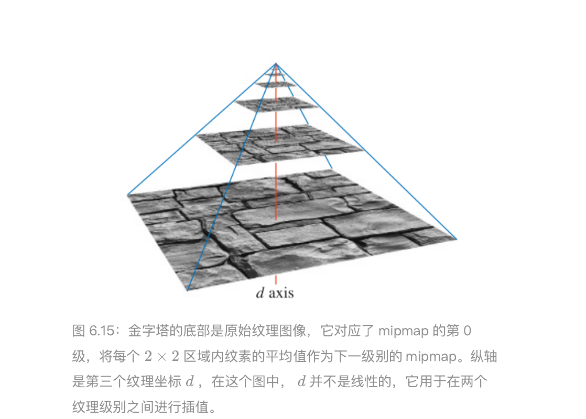

  

生成高质量 mipmap 的两个重要因素分别是:使用良好的过滤和伽马校正。生成mipmap 的常用方法是将每 2 × 2的纹素进行平均,从而获得下一级 mip 所对应的纹素值。具体使用的是一个 box 滤波器,虽然这可能是最糟糕的一个滤波器,使用box 滤波器可能会导致较差的质量,因为它会对低频信息进行模糊,同时保留一些会产生锯齿的高频信息。最好是使用高斯、Lanczos、Kaiser 或者类似的滤波器,这些滤波器的源代码基本都有免费高效的开源实现,同时有一些 API 还支持在 GPU 上进行过滤操作。在靠近纹理边缘进行过滤的时候的地方,需要注意纹理的包装模式(wrapping mode)。对于在非线性颜色空间中进行编码的纹理(例如大多数的彩色纹理),在过滤时忽略伽玛校正会修改该层级 mipmap 的感知亮度。如果使用了未校正的mipmap,相机距离物体越远,物体整体看起来就会越暗,对比度和表面细节也会受到影响。由于这个原因,因此将这种纹理(例如颜色纹理)从 sRGB 颜色空间转换到线性颜色空间是十分重要的,我们会在线性空间中完成 mipmap 的生成和过滤,然后将生产的结果转换回 sRGB 颜色空间中并进行存储。大多数图形 API 都支持 sRGB 纹理,因此可以在线性空间中正确生成 mipmap,并将结果存储在 sRGB中。当访问 sRGB 纹理的时候,它们首先会被转换到线性空间中,以便正确地执行放大(magnification)和缩小(minification)操作。

  

mipmap 的好处在于,它并不是去单独计算每个纹素对像素的影响,而是对预先生成的纹素集合进行访问和插值,无论纹理压缩的程度如何,这个过程的时间开销是固定的。然而,mipmap 也存在几个缺陷,其中一个主要的问题就是过度模糊(overblurring)。我们假设现在有一个像素单元格,它在 u方向上覆盖了大量的纹素,而在 v方向上只覆盖了少量的纹素,这种情况通常发生在相机以一个掠射角度来观察纹理表面的时候。在这种情况下,需要沿着纹理的其中一个轴进行缩小,沿着另一个轴进行放大,这会导致像素在纹理上的投影区域是一个长宽比很大的矩形;而我们在访问 mipmap 时,只能检索纹理上的正方形投影区域,无法检索矩形投影区域。为了避免走样,我们会选择较长的那个边所形成的正方形,来作为对像素单元格覆盖率的近似度量,这导致检索到的样本往往会相对模糊。这种现象可以在图中看到,图片右侧向远处延伸的线条会变得过度模糊。

  

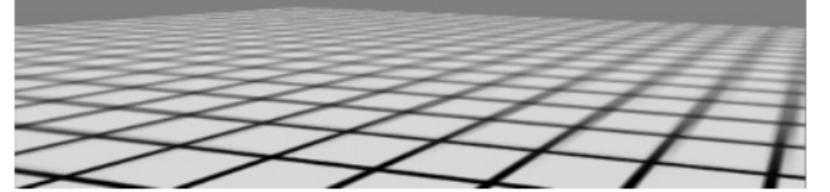

  

### Summed-Area 表(SAT)

  

另一种能够避免过度模糊的方法是面积积分表(summed-area table,SAT,也可以叫做求和面积表),后文中我们会简称为 SAT。想要使用这种方法,首先要创建一个尺寸与纹理相同的数组,但是颜色存储的精度要更高(例如:每个红绿蓝颜色分量都会占据 16 个 bit)。在数组中的每个位置上,该位置上的纹素会和 (0, 0)处的纹素(原点)构成一个矩形,计算并存储区域中所有纹素值的总和。在纹理化的过程中,屏幕上像素在纹理上的投影区域是一个矩形;然后会通过 SAT 来确定这个矩形区域的平均颜色,并将其作为该像素的纹理颜色。这个计算过程如图 6.17 所示,具体的平均颜色计算公式如下:

  

$$c = \frac{s[x_{ur},y_{ur}]-s[x_{ur},y_{ll}]-s[x_{ll},y_{ur}]+s[x_{ll},y_{ll}]}{(x_{ur}-x_{ll})(y_{ur}-y_{ll})}$$

  

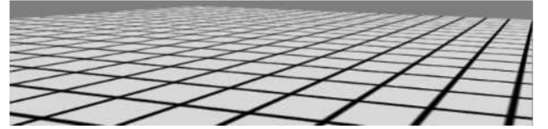

  

图像右侧向远处地平线延申的线条变得更加清晰了,但是中间对角相交的线条仍然是很模糊的。这个问题的原因在于,当我们沿着对角线观察纹理的时候,像素投影所生成的区域是一个沿对角线的细长矩形,该矩形对应的包围盒中包含了大量无关的纹素,例如:在图中,想象此时像素的投影区域是一个横跨纹理对角线的细长区域,它所对应的包围盒几乎会占据整个纹理,而真正位于像素投影区域内的纹素数量则很少。此时这种方法会对整个纹理矩形进行平均,这个结果包含了大量的无关纹素值,从而导致模糊的产生。

  

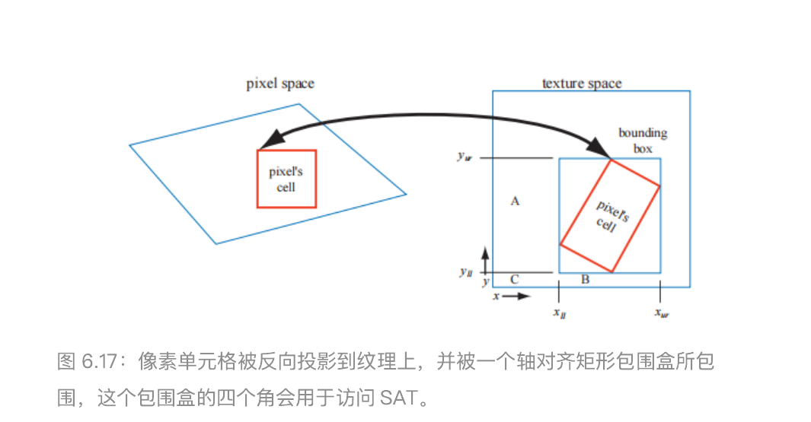

  

SAT 是各向异性过滤(anisotropic filtering)算法的其中一个例子,这类算法用于检索非正方形投影区域的纹理值,SAT 对于接近水平方向或者竖直方向的投影区域最为有效。还需要注意的是,对于 16 × 16或者尺寸更小的纹理,SAT 需要至少两倍的内存;而对于尺寸更大的纹理,则需要更高的存储精度,因为像素值的和会很

  

大,精度过低可能会导致数值溢出。

  

SAT 可以提供更好的质量,并且额外的内存开销还算合理,因此它在现代的 GPU 上也被广泛应用。高质量的过滤方法对于高级渲染技术的质量而言至关重要。例如,Hensley 等人提出了一个高效的实现,并展示了使用 SAT 采样来改善glossy 反射的方法。其他使用区域采样的算法也可以通过 SAT 方法进行改进,例如如景深,阴影贴图,和模糊反射等。

  

#### 无约束的各向异性过滤

  

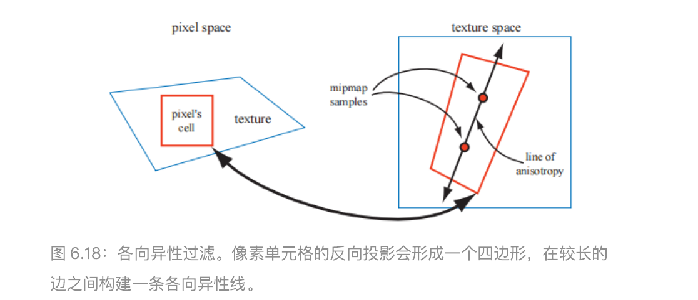

  

在之前我们所提到的方法中,会在 mipmap 中的一个正方形区域内进行采样,这可能会导致采样到很多无关纹素,使得表面变得模糊。这里我们将要介绍的算法,并不是使用单个 mipmap 采样区域来对该投影形成四边形进行近似,而是会使用多个正方形来进行近似。我们使用四边形中较短的那个边来确定 d的值(而在原始的 mipmap中,通常会使用较长的边来确定 d),这样做会使得每个 mipmap 样本的平均面积更小(包含了更少的无关像素,因此会减少模糊的出现)。而四边形的长边则被用来创建一条与其平行,并且穿过四边形中点的各向异性线(line of anisotropy)。当各向异性的比例在 1 : 1和 2 : 1之间时,我们会沿着这条线取两个样本(如图 6.18 所示);各向异性的比例越高,沿轴采集的样本就越多。

  

## 体积纹理（volume texture）

  

对图像纹理直接进行扩展可以得到三维图像数据,它通过坐标 (u, v, w)或者 (s, t, r)来进行访问,例如:医学成像数据可以生成三维网格,通过在网格中移动成像平面,可以看到这些数据的二维切片。

  

如今大部分 GPU 都支持体积纹理(volume texture)的 mipmap,由于在体积纹理的单个 mipmap 级别内,需要使用三线性插值来进行过滤,因此在不同 mipmap 级别之间,需要四线性插值(quadrilinear interpolation)来进行过滤。由于需要对 16个纹素的结果进行求平均,因此可能会导致一些精度不足的问题,这可以通过使用更高精度的体积纹理来进行解决。

  

虽然体积纹理对于存储空间的要求比较高,并且过滤的计算成本也比较高,但它确实具有一些特殊的优势。由于可以直接使用纹理坐标来表示三维的空间位置,因此可以跳过为三维网格寻找一个良好二维参数化表示的复杂过程(UV 拆分)。这避免了二维参数化时经常出现的扭曲和接缝问题。体积纹理也可以用来表示木材或者大理石等材质的体积结构,具有这种纹理的模型,看起来就像是使用这种材料雕刻出来的一样。

  

使用体积纹理来对表面进行纹理化操作是非常低效的,因为体积纹理中的绝大部分样本都没有被使用。Benson 和 Davis 以及 DeBry 等人，讨论了将纹理数据存储在稀疏八叉树中的方法,这种方法非常适合交互式的三维绘画系统,因为我们在创建表面的时候,不需要显式地指定它的纹理坐标,同时八叉树结构可以将纹理细节保留到任何我们想要的级别。Lefebvre 等人讨论了在现代 GPU 上实现八叉树纹理的细节;Lefebvre 和 Hoppe提出了一种将稀疏体积数据打包成较小纹理的方法。

  

## 立方体贴图（cube map）

  

另一种类型的纹理叫做立方体纹理(cube texture)或者立方体贴图(cube map),它具有六个正方形的纹理,立方体的六个面分别对应了这个六个正方形纹理。访问立方体贴图需要使用一个包含三个分量的纹理坐标向量,这个向量代表了从立方体中心向外发射的射线方向。这个射线与立方体交点的计算过程如下:向量中绝对值最大的那个分量,决定了射线会射向哪个立方体表面(例如:向量(−3.2, 5.1, −8.4)代表了射线会射向 −z面)。将剩余的两个坐标分量分别除以最大分量的绝对值(即 8.4),此时这两个分量的大小位于 [−1, 1]内,然后再将其重新映射到 [0, 1]中以计算纹理坐标,例如:坐标 (−3.2, 5.1)会被映射为((−3.2/8.4 + 1)/2,(5.1/8.4 + 1)/2) ≈ (0.31, 0.80)。立方体贴图对于表示方向函数的值而言非常有用;它们最常用于环境映射中。

  

# 程序化纹理

  

## [Adobe Substance 3D Designer](https://www.youtube.com/watch?v=At3FoFcuN6k&t=6s)

  

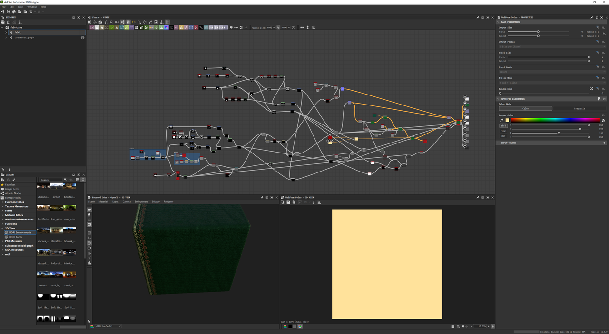

  

# 纹理动画

  

纹理坐标也不一定是静态的。无论是在网格数据本身对纹理坐标进行修改,还是通过顶点着色器或者像素着色器中的函数,来对纹理坐标进行修改,应用程序设计人员都可以显式地改变帧与帧之间的纹理坐标。想象一下,现在我们有了一个已经建模好的瀑布模型,并且它已经被一个图像纹理化了,使得它看起来很像瀑布。假设纹理坐标v是水流的方向,为了让水流动起来,必须从每一帧的坐标 v 中减去一定的数值。纹理坐标的减法操作会使得纹理本身看起来正在向前移动。

  

可以通过对纹理坐标应用变换矩阵来生成更加精细的效果。除了平移之外,它还允许其他的线性变换操作,例如缩放、旋转和剪切,图像扭曲(image warping)和变形转换(morphing transforms),以及广义投影等。通过在 CPU 或者着色器中应用变换函数,可以生成更复杂的效果。

  

通过使用纹理混合(texture blending)技术,还可以实现其他的动画效果。例如:从一个大理石纹理出发,将其渐变为一个肉质纹理,从而使得雕像看起来像是活过来一样。

  

# 纹理映射

  

纹理的一个常见用途是对材质属性进行修改,从而影响着色方程的计算结果。现实世界中的物体通常都会具有不同的表面材质属性,为了模拟这样的物体,像素着色器可以从纹理中读取纹理值,并在计算着色方程之前,使用它们来修改材质的参数。纹理最常修改的参数就是表面是颜色,这种纹理通常被称为反照率颜色贴图(albedo color map)或者漫反射颜色贴图(diffuse color map)。但是,理论上任何参数都可以被纹理进行修改,例如:替换、相乘或者以其他方式等。例如在图 6.25 中的表面,应用了三种不同的纹理来替换常量值。

  

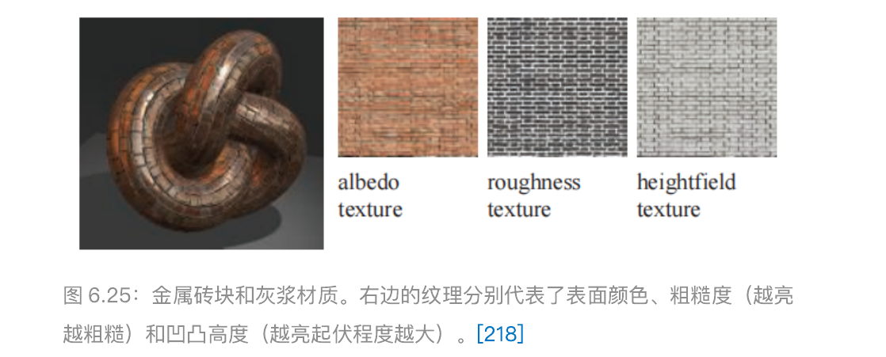